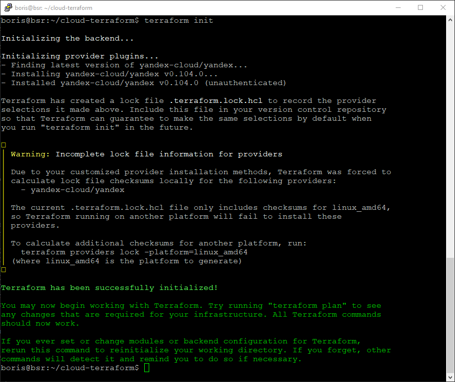

#  Решетников Борис
#  Дипломная работа по профессии «Системный администратор»
Содержание
==========
* [Ход выполнения работы](#Ход-выполнения-работы)
## Ход выполнения работы
1) Зарегистрировался в Yandex Cloud, затем создал и подключил платёжный аккаунт.
2) Была создана при помощи Virtualbox виртуальная машина. Затем была установлена ОС Linux Debian 11. 
3) Затем был установлен интерфейс командной строки Yandex Cloud (CLI).

```
sudo apt install curl -y;
curl -sSL https://storage.yandexcloud.net/yandexcloud-yc/install.sh | bash;
```
После завершения установки была перезапщена командная оболочка:
```
source ~/.bashrc;
```
Далее был получен OAuth-токен в сервисе Яндекс ID. Срок жизни OAuth-токена 1 год. После этого необходимо получить новый OAuth-токен и повторить процедуру аутентификации.

Затем, чтобы начать настройку профиля CLI, была выполнена команда:
```
yc init;
```
В процессе настройки профиля CLI был указан OAuth-токен, затем были выбраны облако и каталог по умолчанию.

4) Далее был создан сервисный аккаунт
```
yc iam service-account create --name <имя_сервисного_аккаунта>
```

Чтобы узнать идентификатор сервисного аккаунта (столбец ID), была выполнена команда:
```
yc iam service-account list
```

Далее сервисному аккаунту была назначена роль admin

```
yc resource-manager folder add-access-binding default \
  --role admin \
  --subject serviceAccount:<идентификатор_сервисного_аккаунта>
```
ajeasaraletivkbtdi6s

Далее был настроен профиль CLI для выполнения операций от имени сервисного аккаунта. Был создан авторизованный ключ для сервисного аккаунта.

```
yc iam key create \
  --service-account-id <идентификатор_сервисного_аккаунта> \
  --folder-name default \
  --output key.json
```
Затем был создан профиль CLI для выполнения операций от имени сервисного аккаунта.

```
yc config profile create bsr-ya-cli
```

Далее была задана конфигурация профиля:

```
yc config set service-account-key key.json
yc config set cloud-id <идентификатор_облака>
yc config set folder-id <идентификатор_каталога>  
```
Теперь можно получить IAM-токен и записать его в переменную окружения:

```
export TF_VAR_iam_token=`(yc iam create-token)`;
```


5) Далее был установлен Terraform. Terraform был скачен с [зеркала](https://hashicorp-releases.yandexcloud.net/terraform/). 

```
wget https://hashicorp-releases.yandexcloud.net/terraform/1.6.6/terraform_1.6.6_linux_amd64.zip
```
Установка Terraform:
```
zcat terraform_1.6.6_linux_amd64.zip > terraform;
sudo mv ./terraform /usr/local/bin/;
cd /usr/local/bin/;
sudo chmod 766 terraform;
cd ~;
terraform --version;
```
Настройка провайдера. Для настройки зеркала в дириктории `~/` создадим файл .terraformrc со следующим содержимым:

```
provider_installation {
  network_mirror {
    url = "https://terraform-mirror.yandexcloud.net/"
    include = ["registry.terraform.io/*/*"]
  }
  direct {
    exclude = ["registry.terraform.io/*/*"]
  }
}
```
6) Далее была создана папка "cloud-terraform". В этой папке был создан конфигурационный файл main.tf 
В начале этого файла были добавлены следующие блоки:
```
terraform {
  required_providers {
    yandex = {
      source = "yandex-cloud/yandex"
    }
  }
  required_version = ">= 0.13"
}

provider "yandex" {
  zone = "ru-central1-b"
}

```
Затем в папке  с конфигурационным файлом main.tf была выполнена команда terraform init для инициализации провайдера.
```
cd ~/cloud-terraform
terraform init
```

