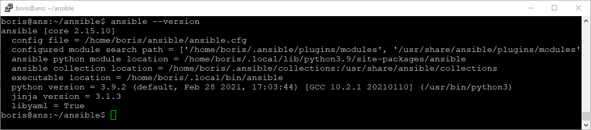

#  Решетников Борис
#  Дипломная работа по профессии «Системный администратор»
Содержание
==========
* [Установка и настройка Terraform](##Установка и настройка Terraform)
* [Подготовка плана инфраструктуры](##Подготовка плана инфраструктуры)
* [Установка Ansible](##Установка Ansible)
* [Копирование сайта на группу web-серверов](##Копирование сайта на группу web-серверов)
* [Установка системы мониторинга Zabbix на виртуальную машину](##Установка системы мониторинга Zabbix на виртуальную машину)
* [Установка Zabbix агентов на хосты](##Установка Zabbix агентов на хосты)


## Установка и настройка Terraform
1) Зарегистрировался в Yandex Cloud, затем создал и подключил платёжный аккаунт.
2) Была создана при помощи Virtualbox виртуальная машина. Затем была установлена ОС Linux Debian 11. 
3) Затем был установлен интерфейс командной строки Yandex Cloud (CLI).

```
sudo apt install curl -y;
curl -sSL https://storage.yandexcloud.net/yandexcloud-yc/install.sh | bash;
```
После завершения установки была перезапущена командная оболочка:
```
source ~/.bashrc;
```
Далее был получен OAuth-токен в сервисе Яндекс ID. Срок жизни OAuth-токена 1 год. После этого необходимо получить новый OAuth-токен и повторить процедуру аутентификации.

Затем, чтобы начать настройку профиля CLI, была выполнена команда:
```
yc init;
```
В процессе настройки профиля CLI был указан OAuth-токен, затем были выбраны облако и каталог по умолчанию.

4) Далее был создан сервисный аккаунт
```
yc iam service-account create --name <имя_сервисного_аккаунта>
```

Чтобы узнать идентификатор сервисного аккаунта (столбец ID), была выполнена команда:
```
yc iam service-account list
```

Далее сервисному аккаунту была назначена роль admin

```
yc resource-manager folder add-access-binding default \
  --role admin \
  --subject serviceAccount:<идентификатор_сервисного_аккаунта>
```

Далее был настроен профиль CLI для выполнения операций от имени сервисного аккаунта.

Был создан авторизованный ключ для сервисного аккаунта.

```
yc iam key create \
  --service-account-id <идентификатор_сервисного_аккаунта> \
  --folder-name default \
  --output key.json
```
Затем был создан профиль CLI для выполнения операций от имени сервисного аккаунта.

```
yc config profile create bsr-ya-cli
```

Далее была задана конфигурация профиля:

```
yc config set service-account-key key.json
yc config set cloud-id <идентификатор_облака>
yc config set folder-id <идентификатор_каталога>  
```
Теперь можно получить IAM-токен и записать его в переменную окружения:

```
export TF_VAR_iam_token=`(yc iam create-token)`;
```


5) Далее был установлен Terraform. Terraform был скачен с [зеркала](https://hashicorp-releases.yandexcloud.net/terraform/). 

```
wget https://hashicorp-releases.yandexcloud.net/terraform/1.6.6/terraform_1.6.6_linux_amd64.zip
```
Установка Terraform:
```
zcat terraform_1.6.6_linux_amd64.zip > terraform;
sudo mv ./terraform /usr/local/bin/;
cd /usr/local/bin/;
sudo chmod 766 terraform;
cd ~;
terraform --version;
```
Настройка провайдера. Для настройки зеркала в дириктории `~/` создадим файл .terraformrc со следующим содержимым:

```
provider_installation {
  network_mirror {
    url = "https://terraform-mirror.yandexcloud.net/"
    include = ["registry.terraform.io/*/*"]
  }
  direct {
    exclude = ["registry.terraform.io/*/*"]
  }
}
```
6) Далее была создана папка "cloud-terraform". В этой папке был создан конфигурационный файл main.tf 
В начале этого файла были добавлены следующие блоки:
```
terraform {
  required_providers {
    yandex = {
      source = "yandex-cloud/yandex"
    }
  }
  required_version = ">= 0.13"
}

provider "yandex" {
  zone = "ru-central1-b"
}

```
Затем в папке  с конфигурационным файлом main.tf была выполнена команда terraform init для инициализации провайдера.
```
cd ~/cloud-terraform
terraform init
```


## Подготовка плана инфраструктуры
Конфигурационные файлы находятся в папке terraform_config_files/cloud-terraform. План инфраструктуры описан в конфигурационном файле main.tf Переменные описаны в файле variables.tf В файле terraform.tfvars заданы значения переменных. В файле outputs.tf описаны выходные переменные. В файле meta.yml находятся метаданные создаваемой виртуальной машины.

### Настройка сети
Сначала была выполнена настройка сети. Была развёрнута облачная сеть network-1, в которой были созданы 6 подсетей subnet-1, subnet-2, subnet-3, subnet-4, subnet-5, subnet-6. Подсети subnet-1 и subnet-4 были размещены в зоне доступности ru-central1-a. Подсети subnet-2, subnet-5 были размещены в зоне доступности ru-central1-b. Подсети subnet-3, subnet-6 были размещены в зоне доступности ru-central1-d. Был создан nat-шлюз nat-gateway и таблица маршрутизации rt, направляющая исходящий трафик на nat-шлюз. Эта таблица маршрутизации rt была привязана к подсетям subnet-1, subnet-2 и subnet-3. Виртуальные машины, не имеющие публичных адресов, будут располагаться в подсетях subnet-1, subnet-2 и subnet-3 и будут иметь доступ в интернет через NAT-шлюз. В подсетях subnet-4, subnet-5 и subnet-6 будут располагаться виртуальные машины с публичными ip адресами.

```
# Создание сети

resource "yandex_vpc_network" "network-1" {
  name = local.network_name
}


# Создание NAT-шлюза

resource "yandex_vpc_gateway" "nat_gateway" {
  name = "nat-gateway"
  shared_egress_gateway {}
}


# Создание Таблицы маршрутизации

resource "yandex_vpc_route_table" "rt" {
  name       = "rt"
  network_id = yandex_vpc_network.network-1.id
  static_route {
    destination_prefix = "0.0.0.0/0"
    gateway_id         = yandex_vpc_gateway.nat_gateway.id
  }
  depends_on     = [
    yandex_vpc_network.network-1,
    yandex_vpc_gateway.nat_gateway
    ]
}

# Создание подсетей

resource "yandex_vpc_subnet" "subnet-1" {
  name           = "subnet-1"
  zone           = "ru-central1-a"
  network_id     = yandex_vpc_network.network-1.id
  v4_cidr_blocks = ["172.16.1.0/24"]
  route_table_id = yandex_vpc_route_table.rt.id
  depends_on     = [
    yandex_vpc_network.network-1,
    yandex_vpc_route_table.rt
    ]
}


resource "yandex_vpc_subnet" "subnet-2" {
  name           = "subnet-2"
  zone           = "ru-central1-b"
  network_id     = yandex_vpc_network.network-1.id
  v4_cidr_blocks = ["172.16.2.0/24"]
  route_table_id = yandex_vpc_route_table.rt.id
  depends_on     = [yandex_vpc_network.network-1,
                    yandex_vpc_route_table.rt
                   ]
}


resource "yandex_vpc_subnet" "subnet-3" {
  name           = "subnet-3"
  zone           = "ru-central1-d"
  network_id     = yandex_vpc_network.network-1.id
  v4_cidr_blocks = ["172.16.3.0/24"]
  route_table_id = yandex_vpc_route_table.rt.id
  depends_on     = [yandex_vpc_network.network-1,
                    yandex_vpc_route_table.rt
                   ]
}

resource "yandex_vpc_subnet" "subnet-4" {
  name           = "subnet-4"
  zone           = "ru-central1-a"
  network_id     = yandex_vpc_network.network-1.id
  v4_cidr_blocks = ["172.16.4.0/24"]
  depends_on     = [yandex_vpc_network.network-1]
}

resource "yandex_vpc_subnet" "subnet-5" {
  name           = "subnet-5"
  zone           = "ru-central1-b"
  network_id     = yandex_vpc_network.network-1.id
  v4_cidr_blocks = ["172.16.5.0/24"]
  depends_on     = [yandex_vpc_network.network-1]
}

resource "yandex_vpc_subnet" "subnet-6" {
  name           = "subnet-6"
  zone           = "ru-central1-d"
  network_id     = yandex_vpc_network.network-1.id
  v4_cidr_blocks = ["172.16.6.0/24"]
  depends_on     = [yandex_vpc_network.network-1]
}

```
#### Карта сети


### Создание образов загрузочных дисков. 

Для создания web-серверов будет использоваться образ LEMP из Marketplace. Это образ с набором предустановленных программных компонентов для создания сайтов и веб-приложений. Включает в себя операционную систему Linux Ubuntu 18.04, веб-сервер Nginx(1.14.0-0ubuntu1.11), СУБД MySQL(5.7.42-0ubuntu0.18.04.1) и интерпретатор PHP (7.2.24-0ubuntu0.18.04.17).

Для создания остальных виртуальных машин будет использоваться образ Debian 11

```
resource "yandex_compute_image" "web_server" {
  name          = "web-server"
  source_family = "lemp"
}


resource "yandex_compute_image" "debian-11" {
  name          = "debian-11"
  source_family = "debian-11"
}

```

### Создание группы безопасности для бастионного хоста
Была создана группа безопасности sg-bastion-host для бастионного хоста со следующими правилами:

| Направление трафика | Описание     | Диапазон портов | Протокол | Тип источника / назначения        | Источник / назначение |
|---------------------|--------------|-----------------|----------|-----------------------------------|-----------------------|
| Входящий            | SSH          | 22              | TCP      | CIDR                              | 0.0.0.0/0             |
| Входящий            | zabbix-agent | 10050           | TCP      | CIDR                              | 172.16.0.0/12         |
| Исходящий           | any          | Весь            | Любой    | CIDR                              | 0.0.0.0/0             |

```
resource "yandex_vpc_security_group" "sg-bastion-host" {
  name        = "sg-bastion-host"
  description = "This rule allows access to the bastion host from the internet"
  network_id  = yandex_vpc_network.network-1.id

  ingress {
    protocol       = "TCP"
    description    = "SSH"
    v4_cidr_blocks = ["0.0.0.0/0"]
    port           = 22
  }

  ingress {
    protocol       = "TCP"
    description    = "zabbix"
    v4_cidr_blocks = ["172.16.0.0/12"]
    port           = 10050
  }

  egress {
    protocol       = "ANY"
    description    = "any"
    v4_cidr_blocks = ["0.0.0.0/0"]
    from_port      = 1
    to_port        = 65535
  }
  depends_on     = [yandex_vpc_network.network-1]
}

```
### Создание и настройка бастионного хоста
Была создана виртуальная машина с публичным адресом. Этой виртуальной машине назначена группа безопасности sg-bastion-host, которая разрешает входящий трафик только на порт 22. Эта виртуальная машина реализует концепцию bastion host.
```
resource "yandex_compute_instance" "vm-bastion-host" {
  name                      = "vm-bastion-host"
  platform_id               = "standard-v2"
  zone = "ru-central1-b"
  allow_stopping_for_update = true
  hostname                  = "bastion"

  resources {
    core_fraction = 5
    cores         = 2
    memory        = 1
  }

  scheduling_policy {
    preemptible = true
  }

  boot_disk {
    initialize_params {
      image_id = yandex_compute_image.debian-11.id
      size     = 3
      type     = "network-hdd"
    }
  }

  network_interface {
    subnet_id          = yandex_vpc_subnet.subnet-5.id
    nat                = true
    security_group_ids = [yandex_vpc_security_group.sg-bastion-host.id]
  }

  metadata = {
    user-data = file("./meta.yml")
  }
  
  depends_on = [
    yandex_compute_image.debian-11,
    yandex_vpc_subnet.subnet-5,
    yandex_vpc_security_group.sg-bastion-host
    ]

}

```

### Создание группы безопасности для L7-балансировщика 
Была создана группа безопасности alb-sg для балансировщика со следующими правилами:

| Направление трафика | Описание     | Диапазон портов | Протокол | Тип источника / назначения        | Источник / назначение |
|---------------------|--------------|-----------------|----------|-----------------------------------|-----------------------|
| Исходящий           | any          | Весь            | Любой    | CIDR                              | 0.0.0.0/0             |
| Входящий            | ext-http     | 80              | TCP      | CIDR                              | 0.0.0.0/0             |
| Входящий            | ext-https    | 443             | TCP      | CIDR                              | 0.0.0.0/0             |
| Входящий            | healthchecks | 30080           | TCP      | Проверки состояния балансировщика | -                     |

```
resource "yandex_vpc_security_group" "alb-sg" {
  name       = "alb-sg"
  network_id = yandex_vpc_network.network-1.id

  egress {
    protocol       = "ANY"
    description    = "any"
    v4_cidr_blocks = ["0.0.0.0/0"]
    from_port      = 1
    to_port        = 65535
  }

  ingress {
    protocol       = "TCP"
    description    = "ext-http"
    v4_cidr_blocks = ["0.0.0.0/0"]
    port           = 80
  }

  ingress {
    protocol       = "TCP"
    description    = "ext-https"
    v4_cidr_blocks = ["0.0.0.0/0"]
    port           = 443
  }

  ingress {
    protocol          = "TCP"
    description       = "healthchecks"
    predefined_target = "loadbalancer_healthchecks"
    port              = 30080
  }
  depends_on     = [yandex_vpc_network.network-1]
}
```

### Создание группы безопасности alb-vm-sg для группы виртуальных машин

Была создана группа безопасности alb-vm-sg для группы ВМ со следующими правилами:

| Направление трафика | Описание     | Диапазон портов | Протокол | Тип источника / назначения       | Источник / назначение |
|---------------------|--------------|-----------------|----------|----------------------------------|-----------------------|
| Входящий            | balancer     | 80              | TCP      | Группа безопасности              | alb-sg                |
| Входящий            | ssh          | 22              | TCP      | CIDR                             | 172.16.0.0/12         |
| Входящий            | zabbix-agent | 10050           | TCP      | CIDR                             | 172.16.0.0/12         |
| Исходящий           | any          | Весь            | Любой    | CIDR                             | 0.0.0.0/0             |

```
resource "yandex_vpc_security_group" "alb-vm-sg" {
  name       = "alb-vm-sg"
  network_id = yandex_vpc_network.network-1.id

  ingress {
    protocol          = "TCP"
    description       = "balancer"
    security_group_id = yandex_vpc_security_group.alb-sg.id
    port              = 80
  }

  ingress {
    protocol       = "TCP"
    description    = "ssh"
    v4_cidr_blocks = ["172.16.0.0/12"]
    port           = 22
  }

  ingress {
    protocol       = "ANY"
    description    = "zabbix"
    v4_cidr_blocks = ["172.16.0.0/12"]
    port           = 10050
  }

  egress {
    protocol       = "ANY"
    description    = "any"
    v4_cidr_blocks = ["0.0.0.0/0"]
    from_port      = 1
    to_port        = 65535
  }
  depends_on     = [
    yandex_vpc_network.network-1,
    yandex_vpc_security_group.alb-sg
    ]
}
```

### Создание и настройка группы виртуальных машин.
Была создана группа виртуальных машин, состоящая из двух виртуальных машин, расположенных в разных зонах доступности - в зонах ru-central1-a и ru-central1-b. В качестве образа/загрузочного диска в Cloud Marketplace был выбран продукт LEMP. Это образ с набором предустановленных программных компонентов для создания сайтов и веб-приложений. Включает в себя операционную систему Ubuntu 18.04, веб-сервер Nginx 1.14.0-0ubuntu1.11, СУБД MySQL и интерпретатор PHP. ВМ были расположены в приватных подсетях subnet-1 и subnet-2. У этих ВМ нет публичного ip-адреса, есть только локальные ip-адреса. ВМ были назначена группа безопасности alb-vm-sg. Для интеграции с Application Load Balancer была создана целевая группа с именем alb-tg.

```
resource "yandex_compute_instance_group" "alb-vm-group" {
  name                = "alb-vm-group"
  folder_id           = var.folder_id
  service_account_id  = yandex_iam_service_account.ig-sa.id
  deletion_protection = "false"

  instance_template {
    platform_id = "standard-v2"

    resources {
      core_fraction = 5
      memory        = 1
      cores         = 2
    }

    boot_disk {
      mode = "READ_WRITE"
      initialize_params {
        image_id = yandex_compute_image.web_server.id
        type     = "network-hdd"
        size     = 3
      }
    }

    scheduling_policy {
      preemptible = true
    }
    hostname = "web-server-{instance.index}"
    network_interface {
      network_id         = yandex_vpc_network.network-1.id
      subnet_ids         = [yandex_vpc_subnet.subnet-1.id, yandex_vpc_subnet.subnet-2.id]
      nat                = false
      security_group_ids = [yandex_vpc_security_group.alb-vm-sg.id]
    }

    metadata = {
      user-data = file("./meta.yml")
    }
  }

  scale_policy {

    fixed_scale {
      size = 2
    }

  }

  allocation_policy {
    zones = ["ru-central1-a", "ru-central1-b"]
  }

  deploy_policy {
    max_unavailable = 1
    max_expansion   = 0
  }

  application_load_balancer {
    target_group_name        = "alb-tg"
    target_group_description = "load balancer target group"
  }

  depends_on = [
    yandex_iam_service_account.ig-sa,
    yandex_resourcemanager_folder_iam_member.editor,
    yandex_vpc_security_group.alb-vm-sg,
    yandex_compute_image.web_server,
    yandex_vpc_subnet.subnet-1,
    yandex_vpc_subnet.subnet-2
  ]

}

```
### Создание группы бэкендов

Была создана группа бэкендов alb-bg. Целевая группа alb-tg, созданная вместе с группой ВМ, была привязана к группе бэкендов alb-bg с настройками распределения трафика. Для бэкендов в группах были созданы проверки состояния: балансировщик будет периодически отправлять проверочные запросы к ВМ и ожидать ответа в течение определенного периода. 

Создан Backend Group, настроен backends на target group. Healthcheck был настроен на корень (/) и порт 80, протокол HTTP.

```
resource "yandex_alb_backend_group" "alb-bg" {
  name = "alb-bg"

  http_backend {
    name             = "backend-1"
    port             = 80
    target_group_ids = [yandex_compute_instance_group.alb-vm-group.application_load_balancer.0.target_group_id]
    healthcheck {
      timeout          = "10s"
      interval         = "2s"
      healthcheck_port = 80
      http_healthcheck {
        path = "/"
      }
    }
  }
  depends_on = [yandex_compute_instance_group.alb-vm-group]
}
```
### Создание HTTP роутера

Был создан HTTP роутер alb-router. 
```
resource "yandex_alb_http_router" "alb-router" {
  name = "alb-router"
  depends_on = [yandex_alb_backend_group.alb-bg]
}
```
Далее был создан виртуальный хост alb-host. Установлено доменное имя сайта через переменную var.domain. Далее был добавлен маршрут с именем "route-1". Далее к HTTP-роутеру была привязана группа бэкендов alb-bg.
```
resource "yandex_alb_virtual_host" "alb-host" {
  name           = "alb-host"
  http_router_id = yandex_alb_http_router.alb-router.id
  authority      = [var.domain, "www.${var.domain}"]
  route {
    name = "route-1"
    http_route {
      http_route_action {
        backend_group_id = yandex_alb_backend_group.alb-bg.id
      }
    }
  }
  depends_on = [yandex_alb_http_router.alb-router]
}
```

### Добавление зоны
Была добавлена зона alb-zone. В качестве зоны был указан зарегистрированный домен сайта. Тип зоны: публичная. 
```
resource "yandex_dns_zone" "alb-zone" {
  name        = "alb-zone"
  description = "Public zone"
  zone        = "${var.domain}."
  public      = true
}
```

### Выпуск сертификата

Выпущен сертификат от Let`s Encrypt. Тип проверки прав на домен - проверка DNS, создаётся специальная DNS-запись типа CNAME.

```
/* Выпуск сертификата */

resource "yandex_cm_certificate" "le-certificate" {
  name    = "le-certificate"
  domains = [var.domain]
  managed {
  challenge_type = "DNS_CNAME"
  }
}

/* Валидация сертфиката */

resource "yandex_dns_recordset" "validation-record" {
  zone_id = yandex_dns_zone.alb-zone.id
  name    = yandex_cm_certificate.le-certificate.challenges[0].dns_name
  type    = yandex_cm_certificate.le-certificate.challenges[0].dns_type
  data    = [yandex_cm_certificate.le-certificate.challenges[0].dns_value]
  ttl     = 300
  depends_on = [yandex_cm_certificate.le-certificate,
                yandex_dns_zone.alb-zone
               ]
}

data "yandex_cm_certificate" "cert" {
  depends_on      = [yandex_dns_recordset.validation-record]
  certificate_id  = yandex_cm_certificate.le-certificate.id
  wait_validation = true
}

# Использование data.yandex_cm_certificate.cert.id, для получения действительного сертификата.

output "cert-id" {
  description = "Certificate ID"
  value       = data.yandex_cm_certificate.cert.id
}

```


### Создание L7-балансировщика

Для распределения трафика на созданные ранее веб-сервера был создан L7-балансировщик (Application load balancer) с именем alb-1. В сетевых настройках была выбрана сеть network-1 и созданная ранее группа безопасности alb-sg. В блоке allocation_policy (политика распределения) были выбраны подсети для узлов балансировщика в каждой зоне доступности. Был создан listener с именем alb-listener. Была включена передача трафика, указан порт 443. В блоке tls в качестве обработчика указан  созданный ранее HTTP router, указан id TLS-сертификата. Был создан listener с именем redirect, который перенаправляет на https http-трафик, полученный, полученный на порт 80.

```
resource "yandex_alb_load_balancer" "alb-1" {
  name               = "alb-1"
  network_id         = yandex_vpc_network.network-1.id
  security_group_ids = [yandex_vpc_security_group.alb-sg.id]

  allocation_policy {
    location {
      zone_id   = "ru-central1-a"
      subnet_id = yandex_vpc_subnet.subnet-1.id
    }

    location {
      zone_id   = "ru-central1-b"
      subnet_id = yandex_vpc_subnet.subnet-2.id
    }

  }

# data.yandex_cm_certificate.cert.id

  listener {
    name = "alb-listener"
    endpoint {
      address {
        external_ipv4_address {
        }
      }
      ports = [443]
    }
    
    tls {
      default_handler {
        certificate_ids = [data.yandex_cm_certificate.cert.id]
        http_handler {
          http_router_id = yandex_alb_http_router.alb-router.id
          }
        }
    }
  }


  listener {
    name = "redirect"
    endpoint {
      address {
        external_ipv4_address {
        }
      }
      ports = [80]
    }

    http {
      redirects {
        http_to_https = true
      }
    }

  }

  depends_on = [yandex_alb_virtual_host.alb-host,
               yandex_vpc_security_group.alb-sg
               ]
}
```

#### Карта балансировки


### Добавление ресурсных записей

#### Добавление ресурсной записи типа A

zone_id: указан id созданной ранее зоны alb-zone.
name: в качестве имени указан домен сайта.
ttl: время кэширования записи в секундах.
type: тип ресурсной записи.
data: значение ресурсной записи. В качестве значения указан ip-адрес L7-балансировщика.

```
resource "yandex_dns_recordset" "rs-1" {
  zone_id = yandex_dns_zone.alb-zone.id
  name    = "${var.domain}."
  ttl     = 600
  type    = "A"
  data    = [yandex_alb_load_balancer.alb-1.listener[0].endpoint[0].address[0].external_ipv4_address[0].address]
  depends_on = [
                yandex_dns_zone.alb-zone,
                yandex_alb_load_balancer.alb-1
                ]
}
```
#### Добавление ресурсной записи типа CNAME

zone_id: указан id созданной ранее зоны alb-zone.
name:www
ttl: время кэширования записи в секундах
type: тип ресурсной записи. В качестве значения указано CNAME
data: значение ресурсной записи. В качестве значения указано доменное имя сайта

Эта ресурсная запись нужна для перенаправления с https://www.example.com на https://example.com 

```
resource "yandex_dns_recordset" "rs-2" {
  zone_id = yandex_dns_zone.alb-zone.id
  name    = "www"
  ttl     = 600
  type    = "CNAME"
  data    = [var.domain]
    depends_on = [
                yandex_dns_zone.alb-zone,
                yandex_alb_load_balancer.alb-1
                ]
}
```

### Создание и настройка группы безопасности для zabbix

Была создана группа безопасности для виртуальной машины, на которую позднее будет установлена система мониторинга Zabbix.

```
resource "yandex_vpc_security_group" "sg-zabbix" {
  name        = "sg-zabbix"
  description = "This rule for zabbix"
  network_id  = yandex_vpc_network.network-1.id

  ingress {
    protocol       = "TCP"
    description    = "webgui"
    v4_cidr_blocks = ["0.0.0.0/0"]
    port      = 80
  }

  ingress {
    protocol       = "TCP"
    description    = "https"
    v4_cidr_blocks = ["0.0.0.0/0"]
    port      = 8080
  }

  ingress {
    protocol       = "TCP"
    description    = "https"
    v4_cidr_blocks = ["0.0.0.0/0"]
    port      = 443
  }

  ingress {
    protocol       = "TCP"
    description    = "ssh"
    v4_cidr_blocks = ["172.16.0.0/12"]
    port      = 22
  }

  egress {
    protocol       = "ANY"
    description    = "any"
    v4_cidr_blocks = ["0.0.0.0/0"]
    from_port      = 1
    to_port        = 65535
  }
  depends_on     = [yandex_vpc_network.network-1]
}
```
### Создание виртуальной машины для системы мониторинга Zabbix.

Была создана виртуальная машины, на которую будет установлена система мониторинга Zabbix. Виртуальная машина была создана с публичным IP-адресом, по которому можно будет подключаться к WEB-интерфейсу Zabbix.

```
resource "yandex_compute_instance" "vm-zabbix" {
  name                      = "vm-zabbix"
  platform_id               = "standard-v2"
  zone                      = "ru-central1-d"
  allow_stopping_for_update = true
  hostname                  = "zabbix"

  resources {
    core_fraction = 50
    cores         = 2
    memory        = 2
  }

  scheduling_policy {
    preemptible = true
  }

  boot_disk {
    initialize_params {
      image_id = yandex_compute_image.debian-11.id
      size     = 20
      type     = "network-hdd"
    }
  }

  network_interface {
    subnet_id          = yandex_vpc_subnet.subnet-6.id
    nat                = true
    security_group_ids = [yandex_vpc_security_group.sg-zabbix.id]
  }

  metadata = {
    user-data = file("./meta.yml")
  }

  depends_on = [
    yandex_vpc_security_group.sg-zabbix,
    yandex_compute_image.debian-11,
    yandex_vpc_subnet.subnet-6
    ]

}

```

### Создание ресурсов

Проверка корректности конфигурационного файла с помощью команды:
```
cd ~/yandex-terraform
terraform validate
```


Применение изменения конфигурации:
```
terraform apply
```
## Установка Ansible
```
sudo apt install python3-pip
python3 -m pip install ansible
export PATH="$HOME/bin:$PATH"
```
Далее создадим папку ~/ansible. И в этой папке создадим конфигурационный файл ansible.cfg со следующим содержимым:

```
[defaults]
# проверка ключей при подключении по SSH отключена
host_key_checking = False
# расположение файла inventory
inventory = inventory.ini
# пользователь, которым подключаемся по ssh
remote_user = user
# отключает сбор фактов
gathering = explicit
# количество хостов, на которых текущая задача выполняется одновременно
forks = 5
[privilege_escalation]
# требуется повышение прав
become = True
# пользователь, под которым будут выполняться 
become_user = root
# способ повышения прав
become_method = sudo
```
Параметр host_key_checking отвечает за проверку ключей при подключении по SSH. Если указать в конфигурационном файле host_key_checking=False, проверка будет отключена. Это полезно, когда с управляющего хоста Ansible надо подключиться к большому количеству устройств первый раз.

Проверим установлен ли Ansible, проверим версию, подключён ли конфигурационный файл. Для этого выполним команду: 
```
cd ~/ansible
ansible --version
```


Далее в папке ~/ansible был создан файл inventory.ini со следующим содержимым:

```
[bastion]
<IP-vm-bastion-host> ansible_ssh_user=user

[webservers:children]
web1
web2

[web1]
web-server-1.ru-central1.internal ansible_ssh_user=user
[web2]
web-server-2.ru-central1.internal ansible_ssh_user=user

[webservers:vars]
ansible_ssh_common_args='-o ProxyCommand="ssh -p 22 -W %h:%p -q user@<IP-vm-bastion-host>"'
```
```
[bastion]
<IP-vm-bastion-host> ansible_ssh_user=user

[yandex_cloud:vars]
ansible_ssh_common_args='-o ProxyCommand="ssh -p 22 -W %h:%p -q user@<IP-vm-bastion-host>"'

[yandex_cloud:children]
webservers
zabbix

[webservers:children]
web1
web2

[web1]
web-server-1.ru-central1.internal ansible_ssh_user=user
[web2]
web-server-2.ru-central1.internal ansible_ssh_user=user

[zabbix]
zabbix.ru-central1.internal ansible_ssh_user=user

```

Вместо "<IP-vm-bastion-host>" указывается ip-адрес виртуальной машины, реализующей концепцию bastion host
Для webservers используются fqdn имена виртуальных машин в зоне ".ru-central1.internal". 
Подключение ansible к серверам через bastion host осуществляется с помощью ProxyCommand 

Проверим доступность хостов с помощью модуля ping.
```
ansible all -m ping
```


## Копирование сайта на группу web-серверов.

Контент сайта размещён на github: https://github.com/bsresh/tsukushi.git 

Скопируем сайт с github на web-серверы при помощи ansible.

Был создан playbook с ролями:

```
- name: "copy content"
  hosts: 
  - webservers
  gather_facts: no
  become: yes
  tags:
  - content
  roles: 
    - name: install_git
    - name: copy_site
      vars:
      - repo_link: https://github.com/bsresh/tsukushi.git
      - dest_folder: /var/www/html/
```

Роль install_git устанавливает git на управляемые хосты:

```
# tasks file for install_git
- name: "Update apt packages"
  apt: 
    update_cache: yes
    force_apt_get: yes
    cache_valid_time: 86400
- name: "Upgrade apt packages"
  apt:
    state: latest
    force_apt_get: yes
- name: "install git"
  apt:
    name:
      - git
    state: latest
```

Роль очищает папку назначения от старых файлов и копирует в неё сайт:
```
# tasks file for copy_site
- name: "Delete content"
  file:
    state: absent
    path: "{{dest_folder}}"
- name: "copy site"
  git:
    repo: "{{repo_link}}"
    dest: "{{dest_folder}}"
    clone: yes
    update: yes
```
Запустим playbook
```
cd ~/ansible
ansible-playbook playbook.yml --tags="content"
```


Протестируем сайт:

```
curl -v tsukushi.ru
```


## Установка системы мониторинга Zabbix на виртуальную машину 

Система мониторинга Zabbix была развёрнута при помощи docker compose. Сначала на виртуальную машину при помощи Ansible были установлены docker и docker compose.

Был создан Playbook:
```
- name: "install docker and docker compose"
  hosts: 
  - zabbix
  gather_facts: no
  become: yes
  tags:
  - install_docker
  - install_docker_compose
  - docker
  - docker_compose_zabbix
  roles: 
    - name: install_docker
```
Была создана роль install_docker:
```
---
# tasks file for install_docker
- name: "Update apt packages"
  apt: 
    update_cache: yes
    force_apt_get: yes
    cache_valid_time: 86400
- name: "Upgrade apt packages"
  apt:
    state: latest
    force_apt_get: yes
- name: install dependencies
  apt:
    name: "{{item}}"
    state: present
    update_cache: yes
  loop:
    - apt-transport-https
    - ca-certificates
    - curl
    - gnupg-agent
    - software-properties-common

- name: add GPG key
  apt_key:
    url: https://download.docker.com/linux/debian/gpg
    state: present

- name: add docker repository to apt
  apt_repository:
    repo: deb https://download.docker.com/linux/debian bullseye stable
    state: present
- name: install docker
  apt:
    name: "{{item}}"
    state: latest
    update_cache: yes
  loop:
    - docker-ce
    - docker-ce-cli
    - containerd.io

- name: "check docker is active"
  service:
    name: docker
    state: started
    enabled: yes

- name: 'Ensure group "docker" exists'
  ansible.builtin.group:
    name: docker
    state: present

- name: adding user to docker group
  user:
    name: user
    groups: docker
    append: yes

- name: Install docker-compose
  get_url:
    url: https://github.com/docker/compose/releases/download/v2.24.3/docker-compose-linux-x86_64
    dest: /usr/local/bin/docker-compose
    mode: 'u+x,g+x'

- name: Change file ownership, group and permissions
  ansible.builtin.file:
    path: /usr/local/bin/docker-compose
    owner: user
    group: user

```
Для разёрывания системы мониторнинга zabbix был создан docker-compose.yml

```
version: "3"
services:
  zabbix-db:
    image: postgres:15.1
    container_name: zabbix-db
    ports:
      - 5432:5432
    volumes:
      - ./pg_data:/var/lib/postgresql/data/pgdata
    environment:
      POSTGRES_PASSWORD: <password>
      POSTGRES_DB: zabbix
      PGDATA: /var/lib/postgresql/data/pgdata
    networks:
      zabbix-monitoring:
        ipv4_address: 172.22.0.2
    restart: always
  
  pgadmin:
    image: dpage/pgadmin4:8.3
    container_name: pgadmin
    environment:
      PGADMIN_DEFAULT_EMAIL: bsresh@yandex.ru
      PGADMIN_DEFAULT_PASSWORD: <password>
    ports:
      - 8080:80
    networks:
      zabbix-monitoring:
        ipv4_address: 172.22.0.3
    restart: always

  zabbix-server:
    image: zabbix/zabbix-server-pgsql:6.2.6-alpine
    links:
      - zabbix-db
    container_name: zabbix-server
    environment:
      DB_SERVER_HOST: 172.22.0.2
      POSTGRES_USER: postgres
      POSTGRES_PASSWORD: <password>
    ports:
      - 10051:10051
    networks:
      zabbix-monitoring:
        ipv4_address: 172.22.0.4
    restart: always


  zabbix-agent:
    image: zabbix/zabbix-agent:6.2.6-alpine
    links:
      - zabbix-server
    container_name: zabbix-agent
    environment:
      ZBX_SERVER_HOST: 172.22.0.4
    networks:
      zabbix-monitoring:
        ipv4_address: 172.22.0.6
    restart: always

  zabbix_wgui:
    image: zabbix/zabbix-web-nginx-pgsql:6.2.6-alpine
    links:
      - zabbix-db
      - zabbix-server
    container_name: zabbix-frontend
    environment:
      ZBX_SERVER_HOST: 172.22.0.4
      ZBX_SERVER_PORT: 10051
      DB_SERVER_HOST: 172.22.0.2
      DB_SERVER_PORT: 5432
      POSTGRES_USER: postgres
      POSTGRES_PASSWORD: <password>
      POSTGRES_DB: zabbix
      ZBX_SERVER_NAME: monitoring
      PHP_TZ: Europe/Moscow
    ports:
      - 80:8080
      - 443:8443
    networks:
      zabbix-monitoring:
        ipv4_address: 172.22.0.5
    restart: always

networks:
  zabbix-monitoring:
    driver: bridge
    ipam:
      config:
      - subnet: 172.22.0.0/24

```
Создан playbook для развёртывания системы мониторнинга Zabbix на виртуальной машине. В playbook используется роль docker_compose_zabbix. Роль docker_compose_zabbix выполняет копирование файла docker-compose.yml на виртуальную машину и развёртывает систему мониторинга Zabbix, используя файл docker-compose.yml

playbook:
```
- name: "docker-compose zabbix-host"
  hosts:
  - zabbix
  gather_facts: yes
  become: yes
  tags:
  - docker_compose_zabbix
  roles: 
    - name: docker_compose_zabbix
      vars:
      - folder: /home/user/zabbix/
      - src: /home/boris/zabbix/docker-compose.yml
      - dest: /home/user/zabbix/docker-compose.yml
```
Роль docker_compose_zabbix:

```
---
#tasks file for docker_compose_zabbix
- name: "сreate directory"
  file:
    path: "{{folder}}"
    state: "directory"

- name: "copy file"
  copy:
    src: "{{src}}"
    dest: "{{dest}}"

- name: Create and start services
  community.docker.docker_compose_v2:
    project_src: "{{folder}}"
  register: output

- name: print home_dirs variable
  ansible.builtin.debug:
    var: output
```
## Установка Zabbix агентов на хосты

Далее на хосты был установлен zabbix-agent.

Playbook:
```
- name: zabbix-agent
  hosts:
  - bastion
  - webservers
  gather_facts: yes
  become: yes
  tags:
  - zabbix_agent
  roles:
    - role: community.zabbix.zabbix_agent
      zabbix_agent_version: 6.2
      zabbix_agent_server: zabbix.ru-central1.internal
```

На хостах webservers был открыт порт 10050, чтобы zabbix-agent был доступен для системы мониторинга zabbix.

Playbook:
```
- name: firewall zabbix agent
  hosts:
  - webservers
  gather_facts: yes
  become: yes
  tags:
  - firewall_zabbix_agent
  tasks:
    - name: firewall zabbix agent
      ansible.builtin.iptables:
        chain: INPUT
        protocol: tcp
        destination_port: 10050
        jump: ACCEPT
    - name: Save current state of the firewall in system file
      community.general.iptables_state:
        state: saved
        path: /etc/iptables/rules.v4
```
