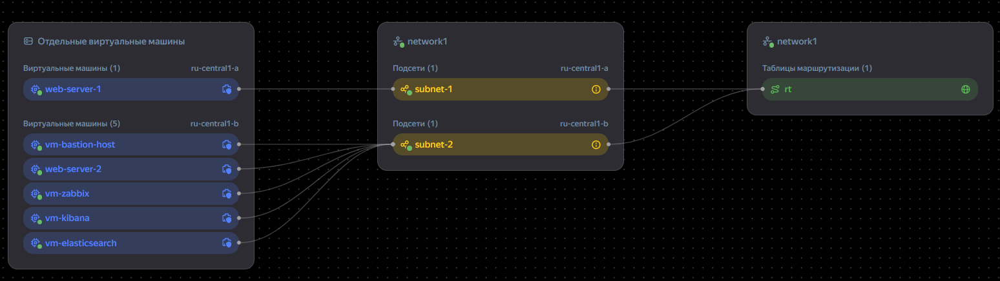
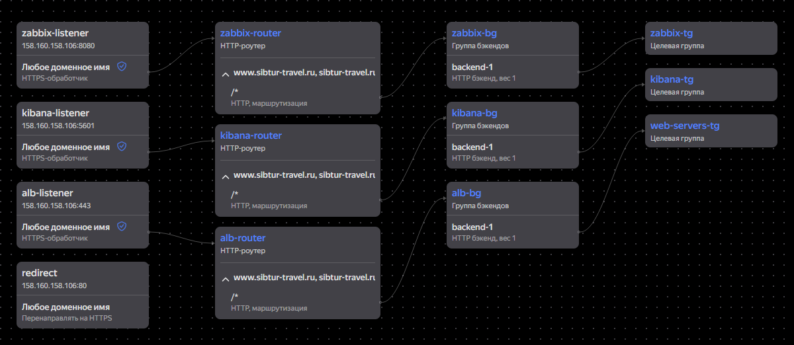
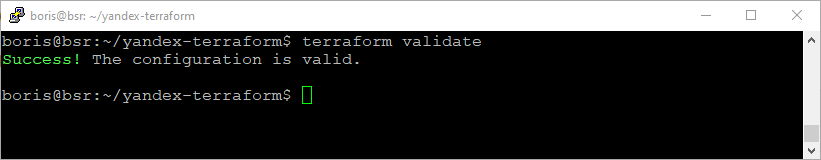
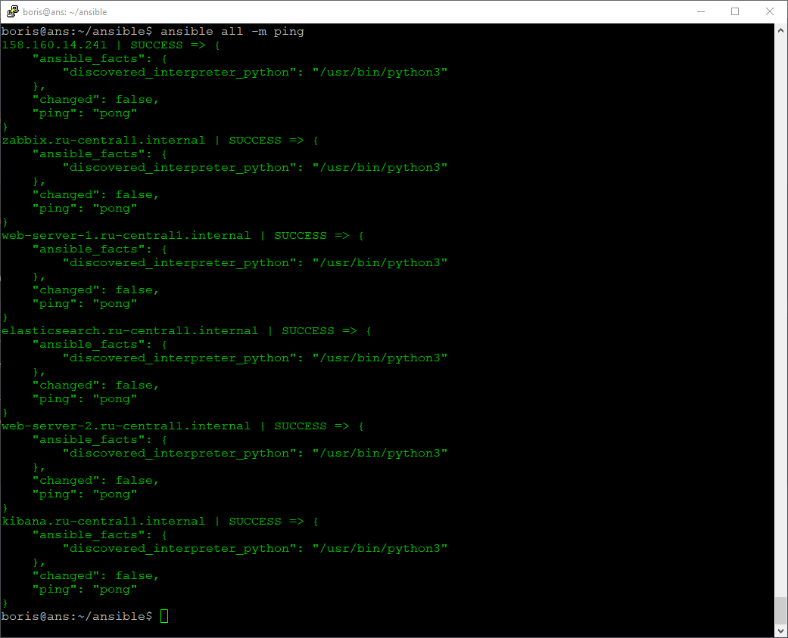
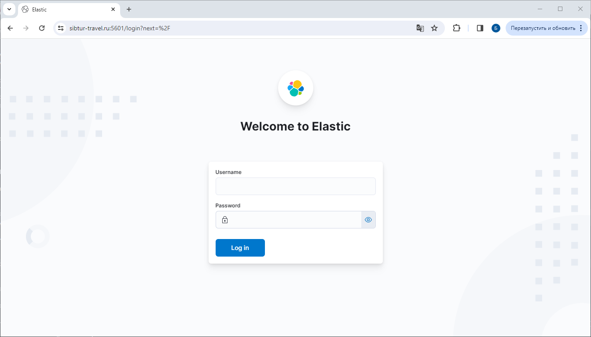
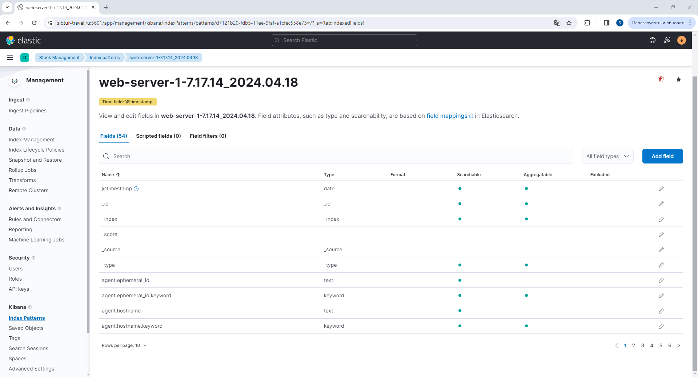
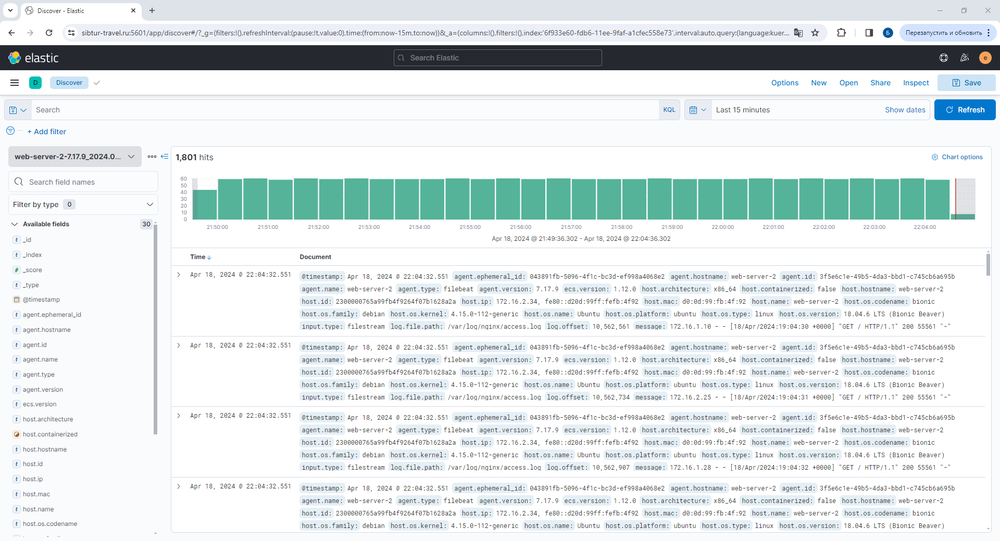

#  Решетников Борис
#  Дипломная работа по профессии «Системный администратор»
Содержание
==========
* [Установка и настройка Terraform](##Установка и настройка Terraform)
* [Подготовка плана инфраструктуры](##Подготовка плана инфраструктуры)
* [Настройка сети](###Настройка сети)
* [Создание образов загрузочных дисков](###Создание образов загрузочных дисков)
* [группы безопасности для бастионного хоста](###Создание группы безопасности для бастионного хоста)
* [Создание и настройка бастионного хоста](###Создание и настройка бастионного хоста)
* [Создание группы безопасности alb-vm-sg для web-серверов](###Создание группы безопасности alb-vm-sg для web-серверов)
* [Создание и настройка web-серверов](###Создание и настройка web-серверов)
* [Создание и настройка группы безопасности для zabbix](###Создание и настройка группы безопасности для zabbix)
* [Создание виртуальной машины для системы мониторинга Zabbix](###Создание виртуальной машины для системы мониторинга Zabbix)
* [Создание и настройка группы безопасности для elasticsearch](###Создание и настройка группы безопасности для elasticsearch)
* [Создание виртуальной машины для Elasticsearch](###Создание виртуальной машины для Elasticsearch)
* [Создание и настройка группы безопасности для Kibana](###Создание и настройка группы безопасности для Kibana)
* [Создание виртуальной машины для kibana](###Создание виртуальной машины для kibana)
* [Создание целевых групп L7-балансировщика](###Создание целевых групп L7-балансировщика)
* [Создание групп бэкендов L7-балансировщика](###Создание групп бэкендов L7-балансировщика)
* [Создание HTTP роутеров](###Создание HTTP роутеров)
* [Добавление зоны](###Добавление зоны)
* [Выпуск сертификата](###Выпуск сертификата)
* [Валидация сертификата](###Валидация сертификата)
* [Создание группы безопасности для L7-балансировщика](###Создание группы безопасности для L7-балансировщика)
* [Создание L7-балансировщика](###Создание L7-балансировщика)
* [Добавление ресурсных записей](###Добавление ресурсных записей)
* [Создание ресурсов](###Создание ресурсов)
* [Установка Ansible](##Установка Ansible)
* [Размещение сайта на web-серверах](###Размещение сайта на web-серверах)
* [Установка docker и docker compose](###Установка docker и docker compose)
* [Установка системы мониторинга Zabbix на виртуальную машину](###Установка системы мониторинга Zabbix на виртуальную машину)
* [Установка Zabbix агентов на хосты](###Установка Zabbix агентов на хосты)
* [Настройка Nginx на web-серверах](###Настройка Nginx на web-серверах)
* [Установка Elasticsearch](###Установка Elasticsearch)
* [Установка Kibana](###Установка Kibana)
* [Установка filebeat](###Установка filebeat)
* [Запуск Playbook](###Запуск Playbook)
* [Настройка Zabbix](##Настройка Zabbix)
* [Настройка Dashboars](###Настройка Dashboars)
* [Настройка Kibana](##Настройка Kibana)
* [Настройка резервного копирования](##Настройка резервного копирования)
* [Выводы](##Выводы)


## Установка и настройка Terraform
1) Зарегистрировался в Yandex Cloud, затем создал и подключил платёжный аккаунт.
2) Была создана при помощи Virtualbox виртуальная машина. Затем была установлена ОС Linux Debian 11. 
3) Затем был установлен интерфейс командной строки Yandex Cloud (CLI).

```
sudo apt install curl -y;
curl -sSL https://storage.yandexcloud.net/yandexcloud-yc/install.sh | bash;
```
После завершения установки была перезапущена командная оболочка:
```
source ~/.bashrc;
```
Далее был получен OAuth-токен в сервисе Яндекс ID. Срок жизни OAuth-токена 1 год. После этого необходимо получить новый OAuth-токен и повторить процедуру аутентификации.

Затем, чтобы начать настройку профиля CLI, была выполнена команда:
```
yc init;
```
В процессе настройки профиля CLI был указан OAuth-токен, затем были выбраны облако и каталог по умолчанию.

4) Далее был создан сервисный аккаунт
```
yc iam service-account create --name <имя_сервисного_аккаунта>
```

Чтобы узнать идентификатор сервисного аккаунта (столбец ID), была выполнена команда:
```
yc iam service-account list
```

Далее сервисному аккаунту была назначена роль admin

```
yc resource-manager folder add-access-binding default \
  --role admin \
  --subject serviceAccount:<идентификатор_сервисного_аккаунта>
```

Далее был настроен профиль CLI для выполнения операций от имени сервисного аккаунта.

Был создан авторизованный ключ для сервисного аккаунта.

```
yc iam key create \
  --service-account-id <идентификатор_сервисного_аккаунта> \
  --folder-name <имя папки> \
  --output key.json
```
Затем был создан профиль CLI для выполнения операций от имени сервисного аккаунта.

```
yc config profile create <имя профиля>
```

Далее была задана конфигурация профиля:

```
yc config set service-account-key key.json
yc config set cloud-id <идентификатор_облака>
yc config set folder-id <идентификатор_каталога>  
```
Теперь можно получить IAM-токен и записать его в переменную окружения:

```
export TF_VAR_iam_token=`(yc iam create-token)`;
```


5) Далее был установлен Terraform. Terraform был скачен с [зеркала](https://hashicorp-releases.yandexcloud.net/terraform/). 

```
wget https://hashicorp-releases.yandexcloud.net/terraform/1.6.6/terraform_1.6.6_linux_amd64.zip
```
Установка Terraform:
```
zcat terraform_1.6.6_linux_amd64.zip > terraform;
sudo mv ./terraform /usr/local/bin/;
cd /usr/local/bin/;
sudo chmod 766 terraform;
cd ~;
terraform --version;
```
Настройка провайдера. Для настройки зеркала в дириктории `~/` создадим файл .terraformrc со следующим содержимым:

```
provider_installation {
  network_mirror {
    url = "https://terraform-mirror.yandexcloud.net/"
    include = ["registry.terraform.io/*/*"]
  }
  direct {
    exclude = ["registry.terraform.io/*/*"]
  }
}
```
6) Далее была создана папка "cloud-terraform". В этой папке был создан конфигурационный файл main.tf 
В начале этого файла были добавлены следующие блоки:
```
terraform {
  required_providers {
    yandex = {
      source = "yandex-cloud/yandex"
    }
  }
  required_version = ">= 0.13"
}

provider "yandex" {
  zone = "ru-central1-b"
}

```
Затем в папке  с конфигурационным файлом main.tf была выполнена команда terraform init для инициализации провайдера.
```
cd ~/cloud-terraform
terraform init
```


## Подготовка плана инфраструктуры
Конфигурационные файлы находятся в папке terraform_config_files/cloud-terraform. План инфраструктуры описан в конфигурационном файле main.tf Переменные описаны в файле variables.tf В файле terraform.tfvars заданы значения переменных. В файле outputs.tf описаны выходные переменные. В файле meta.yml находятся метаданные создаваемой виртуальной машины.

### Настройка сети
Сначала была выполнена настройка сети. Была развёрнута облачная сеть network-1, в которой были созданы 2 подсети: subnet-1 и subnet-2. Подсеть subnet-1 была размещена в зоне доступности ru-central1-a, а подсеть subnet-2 была размещена в зоне доступности ru-central1-b. Также был создан nat-шлюз nat-gateway и таблица маршрутизации rt, направляющая исходящий трафик на nat-шлюз. Эта таблица маршрутизации rt была привязана к подсетям subnet-1, subnet-2. Виртуальные машины, не имеющие публичных адресов будут иметь доступ в интернет через NAT-шлюз. 

```
# Создание сети

resource "yandex_vpc_network" "network-1" {
  name = "network1"
}


# Создание NAT-шлюза

resource "yandex_vpc_gateway" "nat_gateway" {
  name = "nat-gateway"
  shared_egress_gateway {}
}


# Создание Таблицы маршрутизации

resource "yandex_vpc_route_table" "rt" {
  name       = "rt"
  network_id = yandex_vpc_network.network-1.id
  static_route {
    destination_prefix = "0.0.0.0/0"
    gateway_id         = yandex_vpc_gateway.nat_gateway.id
  }
  depends_on     = [
    yandex_vpc_network.network-1,
    yandex_vpc_gateway.nat_gateway
    ]
}

# Создание подсетей

resource "yandex_vpc_subnet" "subnet-1" {
  name           = "subnet-1"
  zone           = "ru-central1-a"
  network_id     = yandex_vpc_network.network-1.id
  v4_cidr_blocks = ["172.16.1.0/24"]
  route_table_id = yandex_vpc_route_table.rt.id
  depends_on     = [
    yandex_vpc_network.network-1,
    yandex_vpc_route_table.rt
    ]
}


resource "yandex_vpc_subnet" "subnet-2" {
  name           = "subnet-2"
  zone           = "ru-central1-b"
  network_id     = yandex_vpc_network.network-1.id
  v4_cidr_blocks = ["172.16.2.0/24"]
  route_table_id = yandex_vpc_route_table.rt.id
  depends_on     = [yandex_vpc_network.network-1,
                    yandex_vpc_route_table.rt
                   ]
}

```
#### Карта сети



### Создание образов загрузочных дисков. 

Для создания web-серверов будет использоваться образ LEMP из Marketplace. Это образ с набором предустановленных программных компонентов для создания сайтов и веб-приложений. Включает в себя операционную систему Linux Ubuntu 18.04, веб-сервер Nginx(1.14.0-0ubuntu1.11), СУБД MySQL(5.7.42-0ubuntu0.18.04.1) и интерпретатор PHP (7.2.24-0ubuntu0.18.04.17).

Для создания остальных виртуальных машин будет использоваться образ Debian 11

```
resource "yandex_compute_image" "web_server" {
  name          = "web-server"
  source_family = "lemp"
}


resource "yandex_compute_image" "debian-11" {
  name          = "debian-11"
  source_family = "debian-11"
}

```

### Создание группы безопасности для бастионного хоста
Была создана группа безопасности sg-bastion-host для бастионного хоста со следующими правилами:

| Направление трафика | Описание     | Диапазон портов | Протокол | Тип источника / назначения        | Источник / назначение |
|---------------------|--------------|-----------------|----------|-----------------------------------|-----------------------|
| Входящий            | SSH          | 22              | TCP      | CIDR                              | 0.0.0.0/0             |
| Входящий            | zabbix-agent | 10050           | TCP      | CIDR                              | 172.16.0.0/12         |
| Исходящий           | any          | Весь            | Любой    | CIDR                              | 0.0.0.0/0             |

Подключение по ssh к бастионному хосту разрешены со всех ip-адресов. Также с бастионного хоста можно подключаться ко всем виртуальным машиным, находящихся в приватных подсетях. Таким образом, бастионный хост является промежуточным хостом, через который можно подключаться ко всем виртуальным машинам в приватных подсетях. Разрешаются входящие соединения от zabbix-агентов, находящихся только внутри приватных подсетях. Исходящие соединения разрешены все.

```
resource "yandex_vpc_security_group" "sg-bastion-host" {
  name        = "sg-bastion-host"
  description = "This rule allows access to the bastion host from the internet"
  network_id  = yandex_vpc_network.network-1.id

  ingress {
    protocol       = "TCP"
    description    = "SSH"
    v4_cidr_blocks = ["0.0.0.0/0"]
    port           = 22
  }

  ingress {
    protocol       = "TCP"
    description    = "zabbix"
    v4_cidr_blocks = ["172.16.0.0/12"]
    port           = 10050
  }

  egress {
    protocol       = "ANY"
    description    = "any"
    v4_cidr_blocks = ["0.0.0.0/0"]
    from_port      = 1
    to_port        = 65535
  }
  depends_on     = [yandex_vpc_network.network-1]
}

```
### Создание и настройка бастионного хоста
Была создана виртуальная машина с публичным адресом. Этой виртуальной машине назначена группа безопасности sg-bastion-host, которая разрешает входящий трафик только на порт 22. Эта виртуальная машина реализует концепцию bastion host.
```
resource "yandex_compute_instance" "vm-bastion-host" {
  name                      = "vm-bastion-host"
  platform_id               = "standard-v2"
  zone = "ru-central1-b"
  allow_stopping_for_update = true
  hostname                  = "bastion"

  resources {
    core_fraction = 5
    cores         = 2
    memory        = 1
  }

  scheduling_policy {
    preemptible = false
  }

  boot_disk {
    initialize_params {
      name = "bastion"
      image_id = yandex_compute_image.debian-11.id
      size     = 3
      type     = "network-hdd"
    }
  }

  network_interface {
    subnet_id          = yandex_vpc_subnet.subnet-2.id
    nat                = true
    security_group_ids = [yandex_vpc_security_group.sg-bastion-host.id]
  }

  metadata = {
    user-data = file("./meta.yml")
  }
  
  depends_on = [
    yandex_compute_image.debian-11,
    yandex_vpc_subnet.subnet-2,
    yandex_vpc_security_group.sg-bastion-host
    ]

}

```

### Создание группы безопасности alb-vm-sg для web-серверов.

Была создана группа безопасности alb-vm-sg для web-серверов со следующими правилами:

| Направление трафика | Описание     | Диапазон портов | Протокол | Тип источника / назначения       | Источник / назначение |
|---------------------|--------------|-----------------|----------|----------------------------------|-----------------------|
| Входящий            | balancer     | 80              | TCP      | Группа безопасности              | alb-sg                |
| Входящий            | ssh          | 22              | TCP      | Группа безопасности              | sg-bastion-host       |
| Входящий            | zabbix-agent | 10050           | TCP      | CIDR                             | 172.16.0.0/12         |
| Исходящий           | any          | Весь            | Любой    | CIDR                             | 0.0.0.0/0             |

Подключение по ssh разрешается только через бастионный хост. Подключение к web-интерфесу zabbix разрешается только через L7-балансировщик. Разрешаются входящие соединения от zabbix-агентов, находящихся только внутри приватной подсети. Исходящие соедниения разрешены все.

```
resource "yandex_vpc_security_group" "alb-vm-sg" {
  name       = "alb-vm-sg"
  network_id = yandex_vpc_network.network-1.id

  ingress {
    protocol          = "TCP"
    description       = "balancer"
    security_group_id = yandex_vpc_security_group.alb-sg.id
    port              = 80
  }

  ingress {
    protocol       = "TCP"
    description    = "ssh"
    security_group_id = yandex_vpc_security_group.sg-bastion-host.id
    port           = 22
  }

  ingress {
    protocol       = "TCP"
    description    = "zabbix"
    v4_cidr_blocks = ["172.16.0.0/12"]
    port           = 10050
  }

  egress {
    protocol       = "ANY"
    description    = "any"
    v4_cidr_blocks = ["0.0.0.0/0"]
    from_port      = 1
    to_port        = 65535
  }
  depends_on     = [ yandex_vpc_network.network-1 ]
}

```

### Создание и настройка web-серверов.
Были созданы 2 виртуальные машины, расположенные в разных зонах доступности - в зонах ru-central1-a и ru-central1-b. В качестве образа/загрузочного диска в Cloud Marketplace был выбран продукт LEMP. Это образ с набором предустановленных программных компонентов для создания сайтов и веб-приложений. Включает в себя операционную систему Ubuntu 18.04, веб-сервер Nginx 1.14.0-0ubuntu1.11, СУБД MySQL и интерпретатор PHP. Виртуальные машины были расположены в приватных подсетях subnet-1 и subnet-2. У этих ВМ нет публичного ip-адреса, есть только локальные ip-адреса. В интернет виртуальные машины имеют доступ через NAT-шлюз. Виртуальным машинам была назначена группа безопасности alb-vm-sg. 
Web-сервера не доступны из интернета напрямую по ip-адресам, сайт будет доступен в интернете благодаря L7-балансеру. Сайт будет доступен по адресу https://sibtur-travel.ru

```
/* Создание Web-сервера № 1 */

resource "yandex_compute_instance" "web-server-1" {
  name                      = "web-server-1"
  platform_id               = "standard-v2"
  zone = "ru-central1-a"
  allow_stopping_for_update = true
  hostname                  = "web-server-1"

  resources {
    core_fraction = 5
    cores         = 2
    memory        = 1
  }

  scheduling_policy {
    preemptible = false
  }

  boot_disk {
    initialize_params {
      name = "web-server-1"
      image_id = yandex_compute_image.web_server.id
      size     = 3
      type     = "network-hdd"
    }
  }

  network_interface {
    subnet_id          = yandex_vpc_subnet.subnet-1.id
    nat                = false
    security_group_ids = [yandex_vpc_security_group.alb-vm-sg.id]
  }

  metadata = {
    user-data = file("./meta.yml")
  }
  
  depends_on = [
    yandex_vpc_security_group.alb-vm-sg,
    yandex_compute_image.web_server,
    yandex_vpc_subnet.subnet-1
    ]
}

/* Создание Web-сервера № 2 */

resource "yandex_compute_instance" "web-server-2" {
  name                      = "web-server-2"
  platform_id               = "standard-v2"
  zone = "ru-central1-b"
  allow_stopping_for_update = true
  hostname                  = "web-server-2"

  resources {
    core_fraction = 5
    cores         = 2
    memory        = 1
  }

  scheduling_policy {
    preemptible = false
  }

  boot_disk {
    initialize_params {
      name = "web-server-2"
      image_id = yandex_compute_image.web_server.id
      size     = 3
      type     = "network-hdd"
    }
  }

  network_interface {
    subnet_id          = yandex_vpc_subnet.subnet-2.id
    nat                = false
    security_group_ids = [yandex_vpc_security_group.alb-vm-sg.id]
  }

  metadata = {
    user-data = file("./meta.yml")
  }
  
  depends_on = [
    yandex_vpc_security_group.alb-vm-sg,
    yandex_compute_image.web_server,
    yandex_vpc_subnet.subnet-2
    ]
}

```

### Создание и настройка группы безопасности для zabbix

Была создана группа безопасности для виртуальной машины, на которую позднее будет установлена система мониторинга Zabbix. Подключение по ssh разрешается только через бастионный хост. Подключение к web-интерфесу zabbix разрешается только через L7-балансировщик. Разрешаются входящие соединения от zabbix-агентов, находящихся только внутри приватной подсети. Исходящие соединения разрешены все.

| Направление трафика | Описание     | Диапазон портов | Протокол | Тип источника / назначения       | Источник / назначение |
|---------------------|--------------|-----------------|----------|----------------------------------|-----------------------|
| Входящий            | ssh          | 22              | TCP      | Группа безопасности              | sg-bastion-host       |
| Входящий            | balancer     | 80              | TCP      | Группа безопасности              | alb-sg                |
| Входящий            | zabbix-agent | 10050           | TCP      | CIDR                             | 172.16.0.0/12         |
| Исходящий           | any          | Весь            | Любой    | CIDR                             | 0.0.0.0/0             |

```
/*Создание и настройка группы безопасности для zabbix*/

resource "yandex_vpc_security_group" "sg-zabbix" {
  name        = "sg-zabbix"
  description = "This rule for zabbix"
  network_id  = yandex_vpc_network.network-1.id


  ingress {
    protocol       = "TCP"
    description    = "ssh"
    security_group_id = yandex_vpc_security_group.sg-bastion-host.id
    port      = 22
  }

  ingress {
    protocol          = "TCP"
    description       = "balancer"
    security_group_id = yandex_vpc_security_group.alb-sg.id
    port              = 80
  }

  ingress {
    protocol       = "TCP"
    description    = "zabbix"
    v4_cidr_blocks = ["172.16.0.0/12"]
    port           = 10050
  }

  egress {
    protocol       = "ANY"
    description    = "any"
    v4_cidr_blocks = ["0.0.0.0/0"]
    from_port      = 1
    to_port        = 65535
  }
  depends_on     = [yandex_vpc_network.network-1]
}

```
### Создание виртуальной машины для системы мониторинга Zabbix.

Была создана виртуальная машины, на которую будет установлена система мониторинга Zabbix. Виртуальная машина была расположена в приватной подсети subnet-2. У этой ВМ нет публичного ip-адреса, есть только локальный ip-адрес. В интернет виртуальная машина имеют доступ через NAT-шлюз. К web-интерфейсу zabbix можно будет получить доступ при помощи L7-балансера. Web-интерфейс zabbix доступен по адресу https://sibtur-travel.ru:8080 Виртуальной машине была назначена группа безопасности sg-zabbix. 

```
/*Создание и настройка zabbix*/

resource "yandex_compute_instance" "vm-zabbix" {
  name                      = "vm-zabbix"
  platform_id               = "standard-v2"
  zone                      = "ru-central1-b"
  allow_stopping_for_update = true
  hostname                  = "zabbix"

  resources {
    core_fraction = 20
    cores         = 2
    memory        = 2
  }

  scheduling_policy {
    preemptible = true
  }

  boot_disk {
    initialize_params {
      name = "zabbix"
      image_id = yandex_compute_image.debian-11.id
      size     = 20
      type     = "network-hdd"
    }
  }

  network_interface {
    subnet_id          = yandex_vpc_subnet.subnet-2.id
    nat                = false
    security_group_ids = [yandex_vpc_security_group.sg-zabbix.id]
  }

  metadata = {
    user-data = file("./meta.yml")
  }

  depends_on = [
    yandex_vpc_security_group.sg-zabbix,
    yandex_compute_image.debian-11,
    yandex_vpc_subnet.subnet-2
    ]

}

```

### Создание и настройка группы безопасности для elasticsearch

Была создана группа безопасности для виртуальной машины, на которую позднее будет установлен elasticsearch. Подключение по ssh разрешается только через бастионный хост. Подключения к elasticsearch разрешены только внутри приватной подсети. Разрешаются входящие соединения от zabbix-агентов, находящихся только внутри приватной подсети. Исходящие соединения разрешены все.

| Направление трафика | Описание     | Диапазон портов | Протокол | Тип источника / назначения       | Источник / назначение |
|---------------------|--------------|-----------------|----------|----------------------------------|-----------------------|
| Входящий            | ssh          | 22              | TCP      | Группа безопасности              | sg-bastion-host       |
| Входящий            | elasticsearch| 9200            | TCP      | CIDR                             | 172.16.0.0/12         |
| Входящий            | zabbix-agent | 10050           | TCP      | CIDR                             | 172.16.0.0/12         |
| Исходящий           | any          | Весь            | Любой    | CIDR                             | 0.0.0.0/0             |

```
/*Создание и настройка группы безопасности для Elasticsearch*/

resource "yandex_vpc_security_group" "sg-elasticsearch" {
  name        = "sg-elasticsearch"
  description = "This rule for elasticsearch"
  network_id  = yandex_vpc_network.network-1.id

  ingress {
    protocol       = "TCP"
    description    = "ssh"
    security_group_id = yandex_vpc_security_group.sg-bastion-host.id
    port      = 22
  }

  ingress {
    protocol       = "TCP"
    description    = "elasticsearch"
    v4_cidr_blocks = ["172.16.0.0/12"]
    port      = 9200
  }

  ingress {
    protocol       = "TCP"
    description    = "zabbix"
    v4_cidr_blocks = ["172.16.0.0/12"]
    port           = 10050
  }

  egress {
    protocol       = "ANY"
    description    = "any"
    v4_cidr_blocks = ["0.0.0.0/0"]
    from_port      = 1
    to_port        = 65535
  }
  depends_on     = [yandex_vpc_network.network-1]
}

```

### Создание виртуальной машины для Elasticsearch

Была создана виртуальная машина, на которую будет установлен elasticsearch. Elasticsearch будет использоваться для сбора и анализа логов access.log и error.log на web-серверах.

```
/*Создание и настройка Elasticsearch*/

resource "yandex_compute_instance" "vm-elasticsearch" {
  name                      = "vm-elasticsearch"
  platform_id               = "standard-v2"
  zone                      = "ru-central1-b"
  allow_stopping_for_update = true
  hostname                  = "elasticsearch"

  resources {
    core_fraction = 5
    cores         = 2
    memory        = 2
  }

  scheduling_policy {
    preemptible = false
  }

  boot_disk {
    initialize_params {
      name = "elasticsearch"
      image_id = yandex_compute_image.debian-11.id
      size     = 20
      type     = "network-hdd"
    }
  }

  network_interface {
    subnet_id          = yandex_vpc_subnet.subnet-2.id
    nat                = false
    security_group_ids = [yandex_vpc_security_group.sg-elasticsearch.id]
  }

  metadata = {
    user-data = file("./meta.yml")
  }

  depends_on = [
    yandex_vpc_security_group.sg-elasticsearch,
    yandex_compute_image.debian-11,
    yandex_vpc_subnet.subnet-2
    ]

}

```

### Создание и настройка группы безопасности для Kibana

Была создана группа безопасности для виртуальной машины, на которую позднее будет установлена kibana -  пользовательский интерфейс, который позволяет визуализировать данные Elasticsearch. Подключение по ssh разрешается только через бастионный хост. Подключение к web-интерфесу kibana разрешается только через L7-балансировщик. Разрешаются входящие соединения от zabbix-агентов, находящихся только внутри приватной подсети. Исходящие соединения разрешены все.

| Направление трафика | Описание     | Диапазон портов | Протокол | Тип источника / назначения       | Источник / назначение |
|---------------------|--------------|-----------------|----------|----------------------------------|-----------------------|
| Входящий            | ssh          | 22              | TCP      | Группа безопасности              | sg-bastion-host       |
| Входящий            | balancer     | 5601            | TCP      | Группа безопасности              | alb-sg                |
| Входящий            | zabbix-agent | 10050           | TCP      | CIDR                             | 172.16.0.0/12         |
| Исходящий           | any          | Весь            | Любой    | CIDR                             | 0.0.0.0/0             |

```
/*Создание и настройка группы безопасности для Kibana*/

resource "yandex_vpc_security_group" "sg-kibana" {
  name        = "sg-kibana"
  description = "This rule for kibana"
  network_id  = yandex_vpc_network.network-1.id

  ingress {
    protocol       = "TCP"
    description    = "ssh"
    security_group_id = yandex_vpc_security_group.sg-bastion-host.id
    port      = 22
  }

  ingress {
    protocol          = "TCP"
    description       = "balancer"
    security_group_id = yandex_vpc_security_group.alb-sg.id
    port              = 5601
  }

  ingress {
    protocol       = "TCP"
    description    = "zabbix"
    v4_cidr_blocks = ["172.16.0.0/12"]
    port           = 10050
  }
  
  egress {
    protocol       = "ANY"
    description    = "any"
    v4_cidr_blocks = ["0.0.0.0/0"]
    from_port      = 1
    to_port        = 65535
  }
  depends_on     = [yandex_vpc_network.network-1]
}

```

### Создание виртуальной машины для kibana

Была создана виртуальная машина, на которую будет установлен Kibana -  пользовательский интерфейс, который позволяет визуализировать данные Elasticsearch. Elasticsearch будет использоваться для сбора и анализа логов access.log и error.log на web-серверах.

```
/*Создание и настройка kibana*/

resource "yandex_compute_instance" "vm-kibana" {
  name                      = "vm-kibana"
  platform_id               = "standard-v2"
  zone                      = "ru-central1-b"
  allow_stopping_for_update = true
  hostname                  = "kibana"

  resources {
    core_fraction = 5
    cores         = 2
    memory        = 2
  }

  scheduling_policy {
    preemptible = true
  }

  boot_disk {
    
    initialize_params {
      name = "kibana"
      image_id = yandex_compute_image.debian-11.id
      # snapshot_id = "fd8a7vb33g9kcmsa59qp"
      size     = 20
      type     = "network-hdd"
    }
  }

  network_interface {
    subnet_id          = yandex_vpc_subnet.subnet-2.id
    nat                = false
    security_group_ids = [yandex_vpc_security_group.sg-kibana.id]
  }

  metadata = {
    user-data = file("./meta.yml")
  }

  depends_on = [
    yandex_vpc_security_group.sg-kibana,
    yandex_compute_image.debian-11,
    yandex_vpc_subnet.subnet-2
    ]

}

```


### Создание целевых групп L7-балансировщика.

Целевая группа L7-балансировщика — это набор IP-адресов виртуальных машин Compute Cloud. Были созданы целевая группа alb-tg для web-серверов, целевая группа zabbix-tg для zabbix и целевая группа kibana-tg для kibana.

```
/* Создание целевой группы для web-серверов */

resource "yandex_alb_target_group" "alb-tg" {
  name           = "web-servers-tg"

  target {
    subnet_id    = yandex_vpc_subnet.subnet-1.id
      ip_address   = yandex_compute_instance.web-server-1.network_interface[0].ip_address
  }

    target {
    subnet_id    = yandex_vpc_subnet.subnet-2.id
      ip_address   = yandex_compute_instance.web-server-2.network_interface[0].ip_address
  }

  depends_on = [
    yandex_compute_instance.web-server-1,
    yandex_compute_instance.web-server-2
    ]

}

/* Создание целевой группы для zabbix */

resource "yandex_alb_target_group" "zabbix-tg" {
  name           = "zabbix-tg"

  target {
    subnet_id    = yandex_vpc_subnet.subnet-2.id
      ip_address   = yandex_compute_instance.vm-zabbix.network_interface[0].ip_address
  }

  depends_on = [yandex_compute_instance.vm-zabbix]

}

/* Создание целевой группы для kibana */

resource "yandex_alb_target_group" "kibana-tg" {
  name           = "kibana-tg"

  target {
    subnet_id    = yandex_vpc_subnet.subnet-2.id
    ip_address   = yandex_compute_instance.vm-kibana.network_interface[0].ip_address
  }
  
  depends_on = [yandex_compute_instance.vm-kibana]
}

```

### Создание групп бэкендов L7-балансировщика.

Была создана группа бэкендов alb-bg для web-серверов.

Целевая группа alb-tg была привязана к группе бэкендов alb-bg с настройками распределения трафика. Для бэкендов в группe alb-bg были созданы проверки состояния: балансировщик будет периодически отправлять проверочные запросы к ВМ и ожидать ответа в течение определенного периода. Healthcheck был настроен на корень (/) и порт 80, протокол HTTP. В зависимости от состояния web-сервера, на него будет или не будет направляться трафик. Если не будет доступен web-сервер 1, но будет доступен web-сервер 2, то трафик будет направляться на web-сервер 2. Таким образом, сайт будет доступен даже если один из web-серверов не будет доступен. Для большей надёжности web-сервера расположены в разных зонах доступности. Поэтому, если не будет работать зона доступности ru-central1-a, но будет работать зона доступности ru-central1-b, сайт будет доступен.

```
/* Создание группы бекендеров для web-серверов */

resource "yandex_alb_backend_group" "alb-bg" {
  name = "alb-bg"

  http_backend {
    name             = "backend-1"
    port             = 80
    target_group_ids = [ yandex_alb_target_group.alb-tg.id ]
    healthcheck {
      timeout          = "10s"
      interval         = "2s"
      healthcheck_port = 80
      http_healthcheck {
        path = "/"
      }
    }
  }
  depends_on = [
  yandex_compute_instance.web-server-1,
  yandex_compute_instance.web-server-2
  ]
}
```

Была создана группа бэкендов группа бэкендов для zabbix. Трафик направляется на zabbix.

```
/* Создание группы бекендеров для zabbix */

resource "yandex_alb_backend_group" "zabbix-bg" {
  name = "zabbix-bg"

  http_backend {
    name             = "backend-1"
    port             = 80
    target_group_ids = [ yandex_alb_target_group.zabbix-tg.id ]
 }

 depends_on = [yandex_alb_target_group.zabbix-tg]

}
```

Была создана группа бэкендов для kibana. Трафик направляется на kibana.

```
/* Создание группы бекендеров для kibana */

resource "yandex_alb_backend_group" "kibana-bg" {
  name = "kibana-bg"

  http_backend {
    name             = "backend-1"
    port             = 5601
    target_group_ids = [yandex_alb_target_group.kibana-tg.id]
 }

 depends_on = [yandex_alb_target_group.kibana-tg]

}

```
### Создание HTTP роутеров

Были созданы HTTP роутеры: alb-router для web-серверов, zabbix-router для zabbix, kibana-router для kibana. HTTP-роутер определяет правила маршрутизации HTTP-запросов в группы бэкендов
```
/* Создание HTTP роутера для web-серверов */

resource "yandex_alb_http_router" "alb-router" {
  name = "alb-router"
  depends_on = [yandex_alb_backend_group.alb-bg]
}

/* Создание HTTP роутера для zabbix */

resource "yandex_alb_http_router" "zabbix-router" {
  name = "zabbix-router"
  depends_on = [yandex_alb_backend_group.zabbix-bg]
}

/* Создание HTTP роутера для kibana */

resource "yandex_alb_http_router" "kibana-router" {
  name = "kibana-router"
  depends_on = [yandex_alb_backend_group.kibana-bg]
}
```
Далее был создан виртуальный хост alb-host. Установлено доменное имя сайта через переменную var.domain. Далее был добавлен маршрут с именем "route-1". Далее к HTTP-роутеру была привязана группа бэкендов alb-bg.
```
/* Создание виртуального хоста для web-серверов */

resource "yandex_alb_virtual_host" "alb-host" {
  name           = "alb-host"
  http_router_id = yandex_alb_http_router.alb-router.id
  authority      = [var.domain, "www.${var.domain}"]
  route {
    name = "route-1"
    http_route {
      http_route_action {
        backend_group_id = yandex_alb_backend_group.alb-bg.id
      }
    }
  }
  depends_on = [yandex_alb_http_router.alb-router]
}

```

Далее был создан виртуальный хост zabbix-host. Установлено доменное имя сайта через переменную var.domain. Далее был добавлен маршрут с именем "route-1". Далее к HTTP-роутеру была привязана группа бэкендов zabbix-bg.

```
/* Создание виртуального хоста для zabbix */

resource "yandex_alb_virtual_host" "zabbix-host" {
  name           = "zabbix-host"
  http_router_id = yandex_alb_http_router.zabbix-router.id
  authority      = [var.domain, "www.${var.domain}"]
  route {
    name = "route-1"
    http_route {
      http_route_action {
        backend_group_id = yandex_alb_backend_group.zabbix-bg.id
      }
    }
  }
  depends_on = [
      yandex_alb_http_router.zabbix-router,
      yandex_alb_backend_group.zabbix-bg
  ]
}

```
Далее был создан виртуальный хост kibana-host. Установлено доменное имя сайта через переменную var.domain. Далее был добавлен маршрут с именем "route-1". Далее к HTTP-роутеру была привязана группа бэкендов kibana-bg.

```
/* Создание виртуального хоста для kibana */

resource "yandex_alb_virtual_host" "kibana-host" {
  name           = "kibana-host"
  http_router_id = yandex_alb_http_router.kibana-router.id
  authority      = [var.domain, "www.${var.domain}"]
  route {
    name = "route-1"
    http_route {
      http_route_action {
        backend_group_id = yandex_alb_backend_group.kibana-bg.id
      }
    }
  }
  depends_on = [
      yandex_alb_http_router.kibana-router,
      yandex_alb_backend_group.kibana-bg
  ]
}

```

### Добавление зоны

Была добавлена зона alb-zone. В качестве зоны был указан зарегистрированный домен сайта. Тип зоны: публичная. 

```
/* Добавление зоны */

resource "yandex_dns_zone" "alb-zone" {
  name        = "alb-zone"
  description = "Public zone"
  zone        = "${var.domain}."
  public      = true
}
```

### Выпуск сертификата

Выпущен сертификат от Let`s Encrypt. 

```
/* Выпуск сертификата */

resource "yandex_cm_certificate" "le-certificate" {
  name    = "le-certificate"
  domains = [var.domain]
  deletion_protection = true
  managed {
  challenge_type = "DNS_CNAME"
  }
}
```
### Валидация сертификата

Далее была выполнена валидация сертификата. Для валидации сертификата была выполнена проверка прав на домен. Тип проверки прав на домен - проверка DNS. Для прохождения этой проверки была создана специальная DNS-запись типа CNAME.

```
/* Валидация сертфиката */

resource "yandex_dns_recordset" "validation-record" {
  zone_id = yandex_dns_zone.alb-zone.id
  name    = yandex_cm_certificate.le-certificate.challenges[0].dns_name
  type    = yandex_cm_certificate.le-certificate.challenges[0].dns_type
  data    = [yandex_cm_certificate.le-certificate.challenges[0].dns_value]
  ttl     = 300
  depends_on = [yandex_cm_certificate.le-certificate,
                yandex_dns_zone.alb-zone
               ]
}

data "yandex_cm_certificate" "cert" {
  depends_on      = [yandex_dns_recordset.validation-record]
  certificate_id  = yandex_cm_certificate.le-certificate.id
  wait_validation = true
}

```
### Создание группы безопасности для L7-балансировщика 

Была создана группа безопасности alb-sg для балансировщика со следующими правилами:

| Направление трафика | Описание     | Диапазон портов | Протокол | Тип источника / назначения        | Источник / назначение |
|---------------------|--------------|-----------------|----------|-----------------------------------|-----------------------|
| Исходящий           | any          | Весь            | Любой    | CIDR                              | 0.0.0.0/0             |
| Входящий            | ext-http     | 80              | TCP      | CIDR                              | 0.0.0.0/0             |
| Входящий            | ext-https    | 443             | TCP      | CIDR                              | 0.0.0.0/0             |
| Входящий            | zabbix       | 8080            | TCP      | CIDR                              | 0.0.0.0/0             |
| Входящий            | kibana       | 5601            | TCP      | CIDR                              | 0.0.0.0/0             |
| Входящий            | healthchecks | 30080           | TCP      | Проверки состояния балансировщика | -                     |

```
resource "yandex_vpc_security_group" "alb-sg" {
  name       = "alb-sg"
  network_id = yandex_vpc_network.network-1.id

  egress {
    protocol       = "ANY"
    description    = "any"
    v4_cidr_blocks = ["0.0.0.0/0"]
    from_port      = 1
    to_port        = 65535
  }

  ingress {
    protocol       = "TCP"
    description    = "ext-http"
    v4_cidr_blocks = ["0.0.0.0/0"]
    port           = 80
  }

  ingress {
    protocol       = "TCP"
    description    = "ext-https"
    v4_cidr_blocks = ["0.0.0.0/0"]
    port           = 443
  }

  ingress {
    protocol       = "TCP"
    description    = "zabbix"
    v4_cidr_blocks = ["0.0.0.0/0"]
    port           = 8080
  }

  ingress {
    protocol       = "TCP"
    description    = "kibana"
    v4_cidr_blocks = local.ingress_site_v4_cidr_blocks
    port           = 5601
  }

  ingress {
    protocol          = "TCP"
    description       = "healthchecks"
    predefined_target = "loadbalancer_healthchecks"
    port              = 30080
  }
  depends_on     = [yandex_vpc_network.network-1]
}

```

### Создание L7-балансировщика

Для распределения трафика на созданные ранее веб-сервера был создан L7-балансировщик (Application load balancer) с именем alb-1. В сетевых настройках была выбрана сеть network-1 и созданная ранее группа безопасности alb-sg. В блоке allocation_policy (политика распределения) были выбраны подсети для узлов балансировщика в каждой зоне доступности. 

Был создан listener с именем alb-listener. Была включена передача трафика, указан порт 443. В блоке tls в качестве обработчика указан  созданный ранее HTTP router, указан id TLS-сертификата. 

Был создан listener с именем redirect, который перенаправляет на https http-трафик, полученный, полученный на порт 80.

Был создан listener с именем zabbix-listener. Была включена передача трафика, указан порт 8080. В блоке tls в качестве обработчика указан  созданный ранее HTTP router, указан id TLS-сертификата. Web-интерфейс Kibana будет открываться по адресу https://sibtur-travel.ru:8080/

Был создан listener с именем kibana-listener. Была включена передача трафика, указан порт 5601. В блоке tls в качестве обработчика указан  созданный ранее HTTP router, указан id TLS-сертификата. Web-интерфейс Kibana будет открываться по адресу https://sibtur-travel.ru:5601/

```

resource "yandex_alb_load_balancer" "alb-1" {
  name               = "alb-1"
  network_id         = yandex_vpc_network.network-1.id
  security_group_ids = [yandex_vpc_security_group.alb-sg.id]

  allocation_policy {
    location {
      zone_id   = "ru-central1-a"
      subnet_id = yandex_vpc_subnet.subnet-1.id
    }

    location {
      zone_id   = "ru-central1-b"
      subnet_id = yandex_vpc_subnet.subnet-2.id
    }

  }

  listener {

    name = "alb-listener"
    endpoint {
      address {
        external_ipv4_address {
        }
      }
      ports = [443]
    }
    
    tls {
      default_handler {
        certificate_ids = [data.yandex_cm_certificate.cert.id]
        http_handler {
          http_router_id = yandex_alb_http_router.alb-router.id
          }
        }
    }
    
    
  }


  listener {
    name = "redirect"
    endpoint {
      address {
        external_ipv4_address {
        }
      }
      ports = [80]
    }

    http {
      redirects {
        http_to_https = true
      }
    }

  }

  listener {
    name = "zabbix-listener"
    endpoint {
      address {
        external_ipv4_address {
        }
      }
      ports = [8080]
    }
    
    tls {
      default_handler {
        certificate_ids = [data.yandex_cm_certificate.cert.id]
        http_handler {
          http_router_id = yandex_alb_http_router.zabbix-router.id
          }
        }
    }
    
  }

  listener {
    name = "kibana-listener"
    endpoint {
      address {
        external_ipv4_address {
        }
      }
      ports = [5601]
    }
    
    tls {
      default_handler {
        certificate_ids = [data.yandex_cm_certificate.cert.id]
        http_handler {
          http_router_id = yandex_alb_http_router.kibana-router.id
          }
        }
    }
    
  }

  depends_on = [yandex_alb_virtual_host.alb-host,
               yandex_vpc_security_group.alb-sg,
               yandex_alb_http_router.alb-router,
               yandex_alb_http_router.zabbix-router,
               yandex_alb_http_router.kibana-router,
               data.yandex_cm_certificate.cert
               ]
}

```

#### Карта балансировки



### Добавление ресурсных записей

#### Добавление ресурсной записи типа A

zone_id: указан id созданной ранее зоны alb-zone.
name: в качестве имени указан домен сайта.
ttl: время кэширования записи в секундах.
type: тип ресурсной записи.
data: значение ресурсной записи. В качестве значения указан ip-адрес L7-балансировщика.

```
resource "yandex_dns_recordset" "rs-1" {
  zone_id = yandex_dns_zone.alb-zone.id
  name    = "${var.domain}."
  ttl     = 600
  type    = "A"
  data    = [yandex_alb_load_balancer.alb-1.listener[0].endpoint[0].address[0].external_ipv4_address[0].address]
  depends_on = [
                yandex_dns_zone.alb-zone,
                yandex_alb_load_balancer.alb-1
                ]
}
```
#### Добавление ресурсной записи типа CNAME

zone_id: указан id созданной ранее зоны alb-zone.
name:www
ttl: время кэширования записи в секундах
type: тип ресурсной записи. В качестве значения указано CNAME
data: значение ресурсной записи. В качестве значения указано доменное имя сайта

Эта ресурсная запись нужна для перенаправления с https://www.sibtur-travel.ru/ на https://sibtur-travel.ru/

```
resource "yandex_dns_recordset" "rs-2" {
  zone_id = yandex_dns_zone.alb-zone.id
  name    = "www"
  ttl     = 600
  type    = "CNAME"
  data    = [var.domain]
    depends_on = [
                yandex_dns_zone.alb-zone,
                yandex_alb_load_balancer.alb-1
                ]
}
```

### Создание ресурсов

Проверка корректности конфигурационного файла с помощью команды:
```
cd ~/yandex-terraform
terraform validate
```


Применение изменения конфигурации:
```
terraform apply
```
## Установка Ansible
```
sudo apt install python3-pip
python3 -m pip install ansible
export PATH="$HOME/bin:$PATH"
```
Далее создадим папку ~/ansible. И в этой папке создадим конфигурационный файл ansible.cfg со следующим содержимым:

```
[defaults]
# проверка ключей при подключении по SSH отключена
host_key_checking = False
# расположение файла inventory
inventory = inventory.ini
# пользователь, которым подключаемся по ssh
remote_user = user
# отключает сбор фактов
gathering = explicit
# количество хостов, на которых текущая задача выполняется одновременно
forks = 5
[privilege_escalation]
# требуется повышение прав
become = True
# пользователь, под которым будут выполняться 
become_user = root
# способ повышения прав
become_method = sudo
```
Параметр host_key_checking отвечает за проверку ключей при подключении по SSH. Если указать в конфигурационном файле host_key_checking=False, проверка будет отключена.

Проверим установлен ли Ansible, проверим версию, подключён ли конфигурационный файл. Для этого выполним команду: 
```
cd ~/ansible
ansible --version
```


Далее в папке ~/ansible был создан файл inventory.ini со следующим содержимым:

```
[bastion]
<IP-vm-bastion-host> ansible_ssh_user=user

[yandex_cloud:vars]
ansible_ssh_common_args='-o ProxyCommand="ssh -p 22 -W %h:%p -q user@<IP-vm-bastion-host>"'

[yandex_cloud:children]
webservers
zabbix
elasticsearch
kibana

[webservers:children]
web1
web2

[web1]
web-server-1.ru-central1.internal ansible_ssh_user=user
[web2]
web-server-2.ru-central1.internal ansible_ssh_user=user

[zabbix]
zabbix.ru-central1.internal ansible_ssh_user=user

[elasticsearch]
elasticsearch.ru-central1.internal ansible_ssh_user=user

[kibana]
kibana.ru-central1.internal ansible_ssh_user=user

```

Вместо "<IP-vm-bastion-host>" указывается ip-адрес виртуальной машины, реализующей концепцию bastion host
Для всех виртуальных машин, кроме bastion host, используются fqdn имена виртуальных машин в зоне ".ru-central1.internal". 
Подключение ansible к серверам через bastion host осуществляется с помощью ProxyCommand 

Проверим доступность хостов с помощью модуля ping.
```
ansible all -m ping
```


### Размещение сайта на web-серверах.

Был создан playbook с ролью copy_site_content.

Playbook:
```
- name: copy site
  hosts: 
   - webservers
  gather_facts: no
  become: yes
  tags:
  - copy_site
  roles: 
    - name: copy_site_content
      html_dir: /var/www/html/
      src: sibtur-travel.ru.zip
```
Роль copy_site_content очищает папку назначения от старых файлов и разархивирует в неё сайт.

### Установка docker и docker compose

Была выполнена установка docker и docker compose на хосты zabbix, elasticsearch и kibana. В дальнейшем docker compose будет использован для установки системы мониторинга Zabbix, системы сбора логов Elasticsearch и web-интерфейса Kibana.

Playbook:
```
- name: install docker and docker compose
  hosts: 
    - zabbix
    - elasticsearch
    - kibana
  gather_facts: no
  become: yes
  roles: 
    - name: install_docker
```

### Установка системы мониторинга Zabbix на виртуальную машину 

На хосте zabbix при помощи docker compose была развёрнута система мониторинга Zabbix.

Playbook:
```
- name: docker-compose zabbix
  hosts:
    - zabbix
  gather_facts: no
  become: yes
  roles: 
    - name: docker_compose_zabbix
```
Файл docker-compose.yml хранится внутри роли docker_compose_zabbix в папке files. Роль docker_compose_zabbix сначала копирует файл docker-compose.yml на хост zabbix, а затем при помощи docker-compose выполняет развёртку системы мониторинга Zabbix на хосте zabbix. На хосте zabbix в трёх docker контейнерах развёрнуты база данных PostgreSQL, Zabbix-server и Zabbix_wgui.
PostgreSQL необходим для работы Zabbix-server: в базе данных хранятся данные мониторинга. Zabbix_wgui - это web-интерфейс для доступа к Zabbix-серверу. Доступ в web-интерфейс осущесвляется по адресу https://sibtur-travel.ru:8080/

Роль docker_compose_zabbix использует модуль community.docker.docker_compose_v2. (https://galaxy.ansible.com/ui/repo/published/community/docker/content/module/docker_compose_v2/)
Для работы этого модуля была установлена коллекция:
```
ansible-galaxy collection install community.docker:3.8.1
```

### Установка Zabbix агентов на хосты

Далее на хост zabbix устанавливается zabbix-agent.

Playbook:
```
- name: zabbix-agent for zabbix-server
  hosts:
    - zabbix
  gather_facts: yes
  become: yes
  roles:
    - role: community.zabbix.zabbix_agent
      zabbix_agent_version: 6.2
      zabbix_agent_server: 172.22.0.3
```
Здесь используется готовая роль community.zabbix.zabbix_agent (https://galaxy.ansible.com/ui/repo/published/community/zabbix/content/role/zabbix_agent/)
Для использования этой роли была установлена коллекция:
```
ansible-galaxy collection install community.zabbix:2.3.1
```
В переменной zabbix_agent_server указывается ip адрес zabbix-сервера. В качестве ip адреса указан ip адрес docker контейнера, в котором установлен zabbix-server.

Также устанавливаем zabbix-agent на остальные хосты: bastion, webservers, kibana, elasticsearch.

```
- name: zabbix-agent
  hosts:
    - bastion
    - webservers
    - kibana
    - elasticsearch
  gather_facts: yes
  become: yes
  roles:
    - role: community.zabbix.zabbix_agent
      zabbix_agent_version: 6.2
      zabbix_agent_server: zabbix.ru-central1.internal
```
В переменной zabbix_agent_server указывается ip адрес zabbix-сервера. В качестве ip адреса указан fqdn адрес виртуальной машины, на которой установлена система мониторинга Zabbix.

На хостах web-server-1, web-server-2 используется образ LEMP из Marketplace, где по умолчанию открыты только 80, 443 и 22 TCP-порты. Для работы zabbix-агентов нужен порт 10050.

На хостах webservers был открыт порт 10050, чтобы zabbix-agent был доступен для системы мониторинга zabbix.

Playbook:

```
- name: firewall zabbix agent
  hosts:
  - webservers
  gather_facts: no
  become: yes
  tasks:
    - name: firewall zabbix agent
      ansible.builtin.iptables:
        chain: INPUT
        protocol: tcp
        destination_port: 10050
        jump: ACCEPT
    - name: Save current state of the firewall in system file
      community.general.iptables_state:
        state: saved
        path: /etc/iptables/rules.v4
```

### Настройка Nginx на web-серверах

Для того, чтобы zabbix мог мониторить Nginx, необходимо в директории /etc/nginx/conf.d разместить конфигурационный файл stub_status.conf со следующим содержимым:

stub_status.conf
```
server {
    listen 127.0.0.1:80;
    server_name 127.0.0.1;
    location /nginx_status {
        stub_status on;
        access_log off;
        allow 127.0.0.1;
        deny all;
        }
        location = /basic_status {
            stub_status;
            allow 127.0.0.1;
            allow ::1;
            deny all;
        }
}

```

Роль nginx_config копирует конфигурационный файл stub_status.conf на web-сервера.

Playbook
```
- name: nginx configuration
  hosts:
   - webservers
  gather_facts: no
  become: yes
  roles:
    - name: nginx_config
  
```
Роль nginx_config
```
---
# tasks file for nginx_config
- name: "copy stub_status.conf"
  copy:
    src: stub_status.conf
    dest: /etc/nginx/conf.d/stub_status.conf

- name: "copy nginx.conf"
  copy:
    src:  nginx.conf
    dest: /etc/nginx/nginx.conf

- name: "restart nginx"
  service:
    name: nginx
    state: restarted

```
### Установка Elasticsearch

На хосте elasticsearch при помощи docker compose была развёрнута система сбора логов Elasticsearch.

Playbook:
```
- name: docker-compose elasticsearch
  hosts:
  - elasticsearch
  gather_facts: no
  become: yes
  roles: 
    - name: docker_compose_elasticsearch
```

Файл docker-compose.yml и конфигурационнй файл для elasticsearch хранятся внутри роли docker_compose_elasticsearch в папке files. Роль docker_compose_elasticsearch сначала копирует файлы на хост elasticsearch, а затем при помощи docker-compose выполняет развёртку системы сборы логов Elasticsearch на хосте elasticsearch.

Роль docker_compose_zabbix использует модуль community.docker.docker_compose_v2. (https://galaxy.ansible.com/ui/repo/published/community/docker/content/module/docker_compose_v2/)
Для работы этого модуля была установлена коллекция:

```
ansible-galaxy collection install community.docker:3.8.1
```

### Установка Kibana

На хосте kibana при помощи docker compose был развёрнут web-интерфейс Kibana, который позволяет визуализировать данные elasticsearch.

Playbook:
```
- name: docker-compose kibana
  hosts:
   - kibana
  gather_facts: no
  become: yes
  roles: 
    - name: docker_compose_kibana
```

Файл docker-compose.yml и конфигурационнй файл для kibana хранятся внутри роли docker_compose_elasticsearch в папке files. Роль docker_compose_kibana сначала копирует файлы на хост kibana, а затем при помощи docker-compose выполняет развёртку web-интерфейса Kibana на хосте elasticsearch.

Роль docker_compose_zabbix использует модуль community.docker.docker_compose_v2. (https://galaxy.ansible.com/ui/repo/published/community/docker/content/module/docker_compose_v2/)
Для работы этого модуля была установлена коллекция:

```
ansible-galaxy collection install community.docker:3.8.1
```

Web-интерфейса Kibana доступен по адресу: https://sibtur-travel.ru:5601

### Установка filebeat

На хостах webservers был установлен filebeat, который нужен для отправки данных в elasticsearch.

Playbook:
```
- name: install filebeat
  hosts: 
  - webservers
  gather_facts: yes
  become: yes
  roles: 
    - name: install_filebeat
```

Playbook install_filebeat устанавливает на web-сервера filebeat, при помощи jinja2 генерирует конфигурационный файл filebeat.yml

filebeat.yml.j2
```
filebeat.inputs:
- type: filestream
  id: nginx-logs
  paths:
    - '/var/log/nginx/access.log'
    - '/var/log/nginx/error.log'
processors:
  - add_host_metadata:
      when.not.contains.tags: forwarded
output.elasticsearch:
  hosts: ["elasticsearch.ru-central1.internal:9200"]
  username: "{{username}}"
  password: "{{password}}"
  indices:
    - index: "{{ansible_hostname}}-%{[agent.version]}_%{+yyyy.MM.dd}"

```

### Запуск Playbook

Далее запустим playbook

```
cd ~/ansible
ansible-playbook playbook.yml
```
Протестируем сайт:

```
curl -v sibtur-travel.ru
```


Код 301 Moved Permanently означает, что документ по запрашиваемому адресу был перемещен, так как была выполнена переадресация с http на https. 

В нашем случае сайт доступен по адресу https://sibtur-travel.ru Если его открыть по адресу http://sibtur-travel.ru, сработает переадресация на адрес https://sibtur-travel.ru.

Проверим открывается ли сайт через браузер:




## Настройка Zabbix

При первом входе в web-интерфейс Zabbix для авторизации используется логин Admin пароль zabbix. При первом входе в в web-интерфейс Zabbix в разделе profile изменим пароль на более сложный. Можно также выбрать другую тему оформления и временную зону:


Далее нужно в разделе "Configuration" => "Hosts" были добавлены хосты на мониторинг


Для мониторинга CPU, RAM, дисков, сети используется шаблон  Linux by Zabbix agent
Для мониторинга http запросов к веб-серверам был создан шаблон  web-server. К этому шаблону был привязан шаблон Nginx by Zabbix agent.

К этому шаблону web-server был привязан шаблон Nginx by Zabbix agent.


Для шаблона web-server был создан item nginx.error.log для мониторинга ошибок


### Настройка Dashboars

На dashboard "Global view" был добавлен widget "Top hosts by CPU utilization", который выводит список хостов по загруженности процессора.


Также были созданы дашборды CPU, RAM, Disks, network, Nginx

В дашборде "CPU" настроено отображение метрик cpu:


В дашборде "RAM" настроено отображение метрик оперативной памяти:


В дашборде "Disks" настроено отображение метрик дисков, свободного пространства:


В дашборде "network" настроено отображение метрик сети:


В дашборде "Nginx" настроено отображение метрик Ngins, http запросов к веб-серверам:


## Настройка Kibana

Kibana доступна по адресу https://sibtur-travel.ru:5601/

#### Создаём index pattern для Web-сервера 1:




#### Логи поступают с Web-сервера 1:


#### Создаём index pattern для Web-сервера 2:


#### Логи поступают с Web-сервера 2:



#### Также можно создать dashboard с отображением соотношения логов access.log и error.log


## Настройка резервного копирования. 

Теперь настроем ежедневное создание копий дисков виртуальных машин. Для этого можно воспользоваться терраформом

В блоке schedule_policy в expression настраивается время копирования. Настроено ежедневное копирование. Время копирования указано по UTC+0

В snapshot_count указано количество хранимых копий дисков. Будет хранится не более 7 копий дисков для каждой виртуальной машины.

```
/* Настройка автоматического создания снимков дисков по расписанию */
resource "yandex_compute_snapshot_schedule" "snapshot-schedule" {
  name = "snapshot-schedule"

  schedule_policy {
    expression = "10 23 ? * *"
  }

  snapshot_count = 7

  snapshot_spec {
    description = "disk snapshots"
  }

  disk_ids = [
    yandex_compute_instance.vm-bastion-host.boot_disk[0].disk_id,
    yandex_compute_instance.vm-zabbix.boot_disk[0].disk_id,
    yandex_compute_instance.vm-elasticsearch.boot_disk[0].disk_id,
    yandex_compute_instance.vm-kibana.boot_disk[0].disk_id,
    yandex_compute_instance.web-server-1.boot_disk[0].disk_id,
    yandex_compute_instance.web-server-2.boot_disk[0].disk_id
    ]

   depends_on = [
    yandex_compute_instance.vm-bastion-host,
    yandex_compute_instance.vm-zabbix,
    yandex_compute_instance.vm-elasticsearch,
    yandex_compute_instance.vm-kibana,
    yandex_compute_instance.web-server-1,
    yandex_compute_instance.web-server-2
   ]

}

```

Также можно создать резевные копии дисков не дожидаясь сработки автоматического создания snapshot. Для этого также воспользуемся терраформом


```
/* Резервное копирование дисков ВМ /*


/***********snapshot-bastion***********************/

resource "yandex_compute_snapshot" "snapshot-bastion" {
  name           = "snapshot-bastion"
  source_disk_id = yandex_compute_instance.vm-bastion-host.boot_disk[0].disk_id
     depends_on = [
     yandex_compute_instance.vm-bastion-host,
     yandex_compute_snapshot_schedule.snapshot-schedule
     ]
}

data "yandex_compute_snapshot" "data-snapshot-bastion" {
  snapshot_id = yandex_compute_snapshot.snapshot-bastion.id
}

output "snapshot-bastion-host" {
  value = data.yandex_compute_snapshot.data-snapshot-bastion
}


/***********snapshot-zabbix***********************/

resource "yandex_compute_snapshot" "snapshot-zabbix" {
  name           = "snapshot-zabbix"
  source_disk_id = yandex_compute_instance.vm-zabbix.boot_disk[0].disk_id
  depends_on = [
  yandex_compute_instance.vm-zabbix,
  yandex_compute_snapshot_schedule.snapshot-schedule
  ]
}


data "yandex_compute_snapshot" "data-snapshot-zabbix" {
  snapshot_id = yandex_compute_snapshot.snapshot-zabbix.id
}

output "snapshot-zabbix" {
  value = data.yandex_compute_snapshot.data-snapshot-zabbix
}


/***********snapshot-elasticsearch***************/

resource "yandex_compute_snapshot" "snapshot-elasticsearch" {
  name           = "snapshot-elasticsearch"
  source_disk_id = yandex_compute_instance.vm-elasticsearch.boot_disk[0].disk_id
  depends_on = [
  yandex_compute_instance.vm-elasticsearch,
  yandex_compute_snapshot_schedule.snapshot-schedule
  ]
}


data "yandex_compute_snapshot" "data-snapshot-elasticsearch" {
  snapshot_id = yandex_compute_snapshot.snapshot-elasticsearch.id
}

output "snapshot-elasticsearch" {
  value = data.yandex_compute_snapshot.data-snapshot-elasticsearch
}


/***********snapshot-kibana***************/

resource "yandex_compute_snapshot" "snapshot-kibana" {
  name           = "snapshot-kibana"
  source_disk_id = yandex_compute_instance.vm-kibana.boot_disk[0].disk_id
  depends_on = [
  yandex_compute_instance.vm-kibana,
  yandex_compute_snapshot_schedule.snapshot-schedule
  ]
}


data "yandex_compute_snapshot" "data-snapshot-kibana" {
  snapshot_id = yandex_compute_snapshot.snapshot-kibana.id
}

output "snapshot-kibana" {
  value = data.yandex_compute_snapshot.data-snapshot-kibana
}


/***********snapshot-web-server-1***************/

resource "yandex_compute_snapshot" "snapshot-web-server-1" {
  name           = "snapshot-web-server-1"
  source_disk_id = yandex_compute_instance.web-server-1.boot_disk[0].disk_id
  depends_on = [
  yandex_compute_instance.web-server-1,
  yandex_compute_snapshot_schedule.snapshot-schedule
  ]
}

data "yandex_compute_snapshot" "data-snapshot-web-server-1" {
  snapshot_id = yandex_compute_snapshot.snapshot-web-server-1.id
}

output "snapshot-web-server-1" {
  value = data.yandex_compute_snapshot.data-snapshot-web-server-1
}


/***********snapshot-web-server-2***************/

resource "yandex_compute_snapshot" "snapshot-web-server-2" {
  name           = "snapshot-web-server-2"
  source_disk_id = yandex_compute_instance.web-server-2.boot_disk[0].disk_id
  depends_on = [
  yandex_compute_instance.web-server-2,
  yandex_compute_snapshot_schedule.snapshot-schedule
  ]
}

data "yandex_compute_snapshot" "data-snapshot-web-server-2" {
  snapshot_id = yandex_compute_snapshot.snapshot-web-server-2.id
}

output "snapshot-web-server-2" {
  value = data.yandex_compute_snapshot.data-snapshot-web-server-2
}

```

## Выводы

Создание отказоустойчивой инфраструктуры для сайта завершено. Инфраструктура включает в себя 2 web сервера, размещённых в разных зонах доступности, что обеспечивает отказоустойчивость сайта. В случае выхода из строя web-сервера 1, будет задействован web-сервера 2. Если не будет доступна зона доступности ru-central1-a, будет доступна зона доступности ru-central1-b. 
Резервное копирование дисков всех виртуальных машин также обеспечивает надёжность. В случае выхода из строя виртуальной машины, данные можно будет восстановить из резервной копии. 
Мониторинг позволяет выявить проблемы, что способствует своевременному принятию мер по недопущению поломки системы. Также мониторинг позволяет обнаружить проблемы, которые, возможно, могут возникнуть в будущеем.
Сбор логов также позволяет выявить причины неполадок, если такие возникнут в системе.
Bastion host обеспечивает безопасность подключения к внутренним ресурсам по ssh. В случае если будет повреждён Bastion host, остальные ресурсы не пострадают. 
Для сайта был выпущен сертификат от Let`s Encrypt. Благодаря этому пользователи могут безопасно пользоваться сайтом по протоколу https. Также по протоколу https доступны web-интерфейсы zabbix и kibana, что позволяет безопасно авторизовываться.
